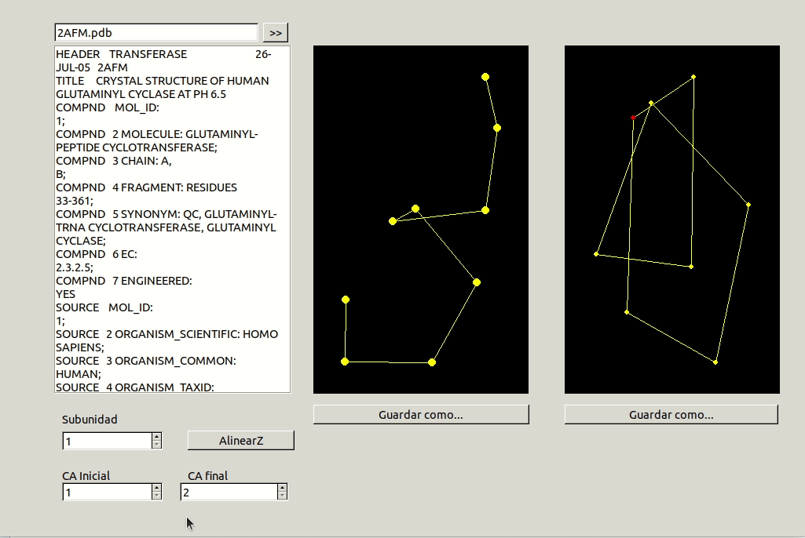
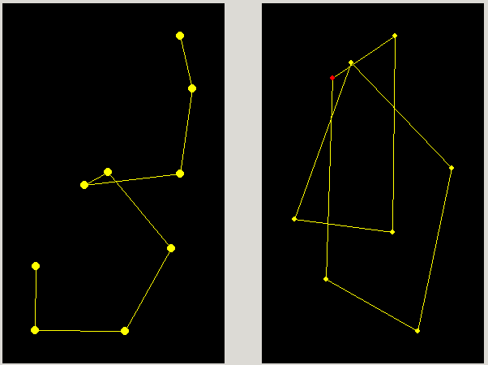
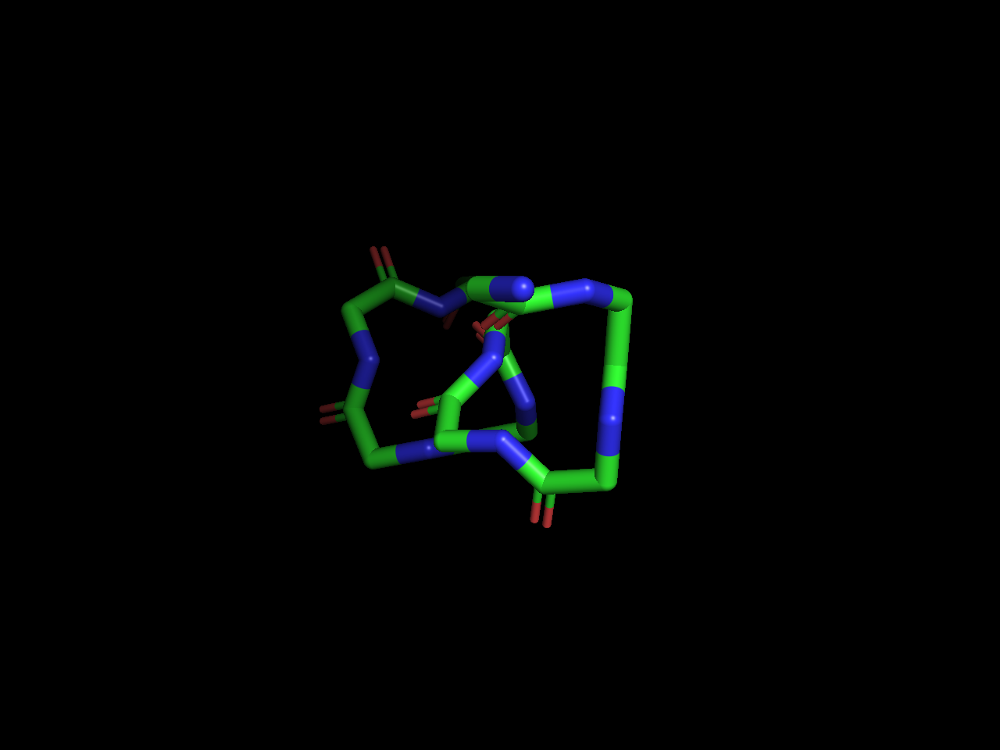

# Alinear Z

En la realización de este cuaderno de actividades se pide el desarrollo de una aplicación capaz de proyectar en el plano las posiciones de los Ca de un fragmento definido de la proteína y realizar las transformaciones necesarias para superponer el primer y último punto en dicha proyección. El código correspondiente a las funciones utilizadas para la transformación (traslación y giro) las coordenadas se encuentran en la librería [biotools/src_biotools](https://github.com/currocam/biotools_hQC/blob/master/biotools/src_biotools.pas) y la aplicación bajo el nombre de [alinear_Z](https://github.com/currocam/biotools_hQC/tree/master/alinear_Z). Este apartado se corresponde a la 8ª actividad de la relación de ejercicios.

## Transformaciones para superponer dos puntos

A continuación, vamos a detallar las transformaciones que deben de realizarse sobre los el conjunto de puntos correspondientes a los $\text{C}_\alpha$, las cuales fueron tratadas en clase. Destacar que, aunque en clase se vio de forma teórica cómo se podría resolver el problema de forma matricial (usando matrices de transformación para hacer computacionalmente menos costoso el problema), la implementación consiste en la aplicación sucesiva de las funciones de transformación ya desarrolladas. Consideraremos que dicho conjunto de coordenadas atómicas correspondiente a los $\text{C}_\alpha$ es el siguiente:

$$
C = \{\vec{p_1}, \vec{p_2}, ..., \vec{p_{n-i}}, \vec{p_n}\}
$$

y donde cada elemento es un vector tal que

$$
\vec{p_1}= \begin{pmatrix}x_i & y_i & z_i\end{pmatrix}
$$

Destacar que, en el desarrollo teórico matricial estudiado en clase, deberíamos considerar en las matrices una "columna extra" de 1. Las transformaciones que realizaremos son las siguientes:


1.Traslación del conjunto de puntos en el espacio de modo que se cumpla que $T(\vec{p_1})= \begin{pmatrix}0 & 0 & 0\end{pmatrix}$.

2.Rotación del conjunto de puntos respecto al eje $x$ de modo que el punto n-ésimo que ha sido previamente transladado, $\vec{p_n}'$, cumpla que

$$
Rot_{OX}(\vec{p_n}')= \begin{pmatrix}x'_n & 0 & z'_n\end{pmatrix}
$$

3.Rotación del conjunto de puntos respecto al eje $y$ hasta que la trayectoria del vector $\vec{v} = \vec{p_n}'-\vec{p_1}'$ coincida con el eje $z$. O, dicho de otro modo, hasta que se cumpla que:

$$
Rot_{OY}(\vec{p_n}'')= \begin{pmatrix}0 & 0 & z''_n\end{pmatrix}
$$

### Criterio de signos

El criterio de signos empleado es el siguiente. Dados unos valores del punto n-esimo, para alinear correctamente el primer punto con este, se considera si  $z_n>0$. Si la coordenada $z$ del punto n-ésimo es mayor que 0, es decir, que está en uno de los 4 cuadrantes superiores (considerando que el eje $z$ se encuentra en vertical en nuestro sistema de referencia), se deberá rotar sobre el eje $\text{OX}$ en sentido positivo o antihorario y sobre el eje $\text{OY}$ en sentido negativo u horario, mientras que si la coordenada $z$ del punto n-ésimo es mayor que 0, es decir, que está en uno de los 4 cuadrantes inferiores, se deberá rotar sobre el eje $\text{OX}$ en sentido negativo u horario y sobre el eje $\text{OY}$ en sentido positivo o antihorario.

Finalmente, la implementación de las tres transformaciones anteriores en forma de función se muestra a continuación:

???+ example "alinear_Z()"
	```pascal linenums="1"
    function AlinearZ(puntos: Tpuntos):TPuntos;
    var
    S: TPuntos;
    p1, p2: TPunto;
    a, b, c, d1, d2: real;
    alpha, phi, senoAlpha, senoPhi: real;
    begin
    setLength(S, high(puntos)+1);
    //Transladar
    p1:= puntos[0];
    S:= translacion(-p1.X, -p1.Y, -p1.Z, puntos);
    //Calcular ángulos
    a:= S[high(S)].X;
    b:= S[high(S)].Y;
    c:= S[high(S)].Z;
    d1:= sqrt(sqr(b)+sqr(c));
    d2:= sqrt(sqr(a)+sqr(b)+sqr(c));
    senoPhi:= b/d1;
    senoAlpha:= a/d2;
    phi:= arcsin(senoPhi);
    alpha:= arcsin(senoAlpha);
    if c<0 then phi:= -phi else alpha:= -alpha; //Cambio signo
    //Giro sobre OX y OY
    S:= GiroOX(phi, S);
    S:= GiroOY(alpha, S);
    result:= S;
    end;
	```

## Aplicación Free Pascal/Lazarus

Nuestra aplicación deberá tener, entonces, una interfaz que permita al usuario seleccionar un fragmento de la proteína, deberá ser capaz de extraer solo los $\text{C}_{\alpha}$ de la instancia de `TPDB` y dos paneles donde se muestre gráficamente el resultado de la transformación.

Además, el último residuo del fragmento es coloreado de un color distinto, para poder comprobar con facilidad que el programa está funcionando adecuadamente,  y se implementó tanto un mensaje de advertencia cuando el usuario introducía un valor de $\text{C}_{\alpha, \text{inicial}}$ inferior a $\text{C}_{\alpha, \text{final}}$ como un botón debajo de cada imagen para poder guardarla directamente usando un `TSavePictureDialog`. Por último, al igual que en el programa `estereodiagrama`, se tiene en cuenta la subunidad marcada por el usuario para restringir los residuos que el usuario puede elegir.      

### Demostración de uso

||
|:-----------------------------------------------------------------------------:|
| Figura 1. Animación del programa `alinear_Z` mostrando su uso.|

### Verificación con PyMol
Por último, se pide que se compruebe la corrección de la transformación realizada empleando un programa de visualización de proteínas. Mostramos a continuación la imagen resultante de alinear los residuos 35 a 43 de la proteína 2AFM con nuestro programa:

||
|:-----------------------------------------------------------------------------:|
| Figura 2. Proyección sobre el plano de los residuos 35 a 43 de la proteína 2AFM, mostrando las coordenadas $y$ frente a $x$ antes y después de alinear.|


||
|:-----------------------------------------------------------------------------:|
| Figura 4. Visualización de los residuos 35 a 43 de la proteína 2AFM con PyMol después de alinear manualmente el primer y último residuo del fragmento.|

Como se puede observar, el programa desarrollado funciona adecuadamente y es capaz, no solo de realizar las transformaciones pertinentes, sino, también, mostrarlas gráficamente, aunque sea de una forma rudimentaria.
