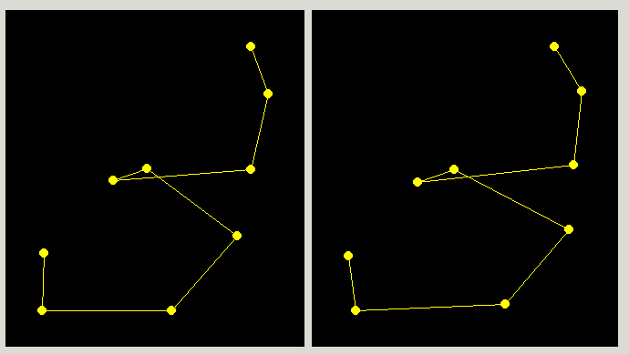

# Esterodiagrama

En la realización de este cuaderno de actividades se pide el desarrollo de una aplicación capaz de crear un esterodiagrama de un fragmento  El código correspondiente a las funciones utilizadas para transformar (translación y giro) las coordenadas se encuentran en la librería [biotools/src_biotools](https://github.com/currocam/biotools_hQC/blob/master/biotools/src_biotools.pas) y la aplicación bajo el nombre de [esterodiagrama](https://github.com/currocam/biotools_hQC/blob/master/biotools/esterodiagrama).


## Funciones de transformación
En primer lugar, mostramos a continuación las funciones empleadas para transformar las un conjunto de coordenadas. Para escribir estas funciones,que fueron desarrolladas en clase, se sobrecargaron las funciones demanera que se puede transladar tanto un punto en el espacio, `TPunto`,  un array dinámico `TPuntos` como un `TPDB`. En los siguientes bloques de código se ha escogido una serie de funciones representativas de este pequeño módulo 'espacial' obtenido. 

=== "translacion(dx, dy, dz: real; V: Tpunto)"

	```pascal linenums="1"
    function translacion(dx, dy, dz: real; V: Tpunto): Tpunto;
    var
       S: Tpunto;
    begin
       S.X:=V.X +dx;
       S.Y:=V.Y +dy;
       S.Z:=V.Z +dz;
       result:= s;
    end;
	```
=== "translacion(dx, dy, dz: real; datos: Tpuntos)"
	```pascal linenums="1"
    function translacion(dx, dy, dz: real; datos: Tpuntos): Tpuntos; overload;
    var
       s: Tpuntos;
       j: integer;
    begin
       setLength(s, high(datos)+1);
       for j:=0 to high(datos) do
       begin
         s[j] := translacion(dx, dy, dz, datos[j]) ;
       end;
       result := s;
    end;
	```
=== "translacion(dx, dy, dz: real; var p: TPDB)"
	```pascal linenums="1"
    function translacion(dx, dy, dz: real; var p: TPDB): integer; overload;
    var
       j: integer;
    begin
       for j:=1 to p.NumFichas do
       begin
           p.atm[j].coor.x := p.atm[j].coor.x + dx;
           p.atm[j].coor.y := p.atm[j].coor.y + dy;
           p.atm[j].coor.z := p.atm[j].coor.z + dz;
       end;
       result:=1;
    end;
	```
Destacar que, siguiendo ideas del paradigma de programación funcional, se pensó implementar una función más genérica llamada `girarTpuntos` que recibe tanto un ángulo en radianes como una función capaz de girar un vector en el espacio y aplicar dicha transformación a todos los vectores del array. Esta idea podría ser implementada de forma más genérica con una función que recibiese como argumentos el array a transformar y una función transformadora y se obtendría así un código más claro y conciso.  


=== "girarTpuntos(rad: real; datos:Tpuntos; funcion_girar:TTransformTPuntoFunc)"

	```pascal linenums="1"
    function girarTpuntos(rad: real; datos:Tpuntos; funcion_girar:TTransformTPuntoFunc): Tpuntos;
    var
       s: Tpuntos;
       j: integer;
    begin
         setLength(s, high(datos)+1);
         for j:=0 to high(datos) do
         begin
         s[j] := funcion_girar(rad, datos[j]) ;
         end;
         result := s;
    end;
	```
=== "GiroOZ(rad: real; V: Tpunto)"
	```pascal linenums="1"
    function GiroOZ(rad: real; V: Tpunto): Tpunto;
    var
       S: Tpunto;
       seno, coseno: real;
    begin
       seno:= sin(rad);
       coseno:= cos(rad);
       S.X:= V.X*coseno - V.Y*seno;
       S.Y:= V.X*seno +V.Y*coseno;
       S.Z:= V.Z;

       result:= S;
    end;
	```
=== "GiroOX(rad: real; datos: Tpuntos)"

	```pascal linenums="1"
    function GiroOX(rad: real; datos: Tpuntos): Tpuntos; overload;
    var
       s: Tpuntos;
       j: integer;
    begin
       setLength(s, high(datos)+1);
       for j:=0 to high(datos) do
       begin
         s[j] := GiroOX(rad, datos[j]) ;
       end;
       result := s;
    end;
	```
=== "GiroOY(rad: real; datos: Tpuntos)"
	```pascal linenums="1"
    function GiroOY(rad: real; datos: Tpuntos): Tpuntos; overload;
    var
       s: Tpuntos;
       j: integer;
    begin
       setLength(s, high(datos)+1);
       for j:=0 to high(datos) do
       begin
         s[j] := GiroOY(rad, datos[j]) ;
       end;
       result := s;
    end;
	```
##  Esterodiagrama
Un esterodiagrama es un tipo de representación donde se muestra una imagen en dos dimensiones rotada en torno al eje Y (por defecto) un pequeño ángulo (por defecto 5º) de manera que al visualizarse las dos una al lado de la otra se aprecie cierta tridimensionalidad. 

Nuestra aplicación deberá tener, entonces, una interfaz que permita al usuario seleccionar un fragmento de la proteína, un eje y un ángulo de giro. También se incluye una opción para modificar el archivo e memoria y poder hacer así transformaciones sucesivas así como una opción para elegir qué ejes se quieren representra.  A continuación, mostramos el procedimiento empleado para transformar las coordenadas espaciales iniciales según las indicaciones del usuario (o las coordenadas espaciales previamente transformadas si así se indica). Lo hemos incluido porque nos parecía relevante mostrar un ejemplo de uso de la función `girarTpuntos`puesto que es una función compleja y la manera que encontramos para solventar algunos de los posibles errores que podían surgir al realizar transformaciones en memoria (si se cambiaba el array de `TPuntos` inicial o si todavía no se había definido). En primer lugar, definimos un tipo de variable llamado `TTransformTpuntoFunc`. En segundo lugar, mostramos el procedimiento empleado. 

=== "TTransformTPuntoFunc"

	```pascal linenums="1"
    TTransformTPuntoFunc = function(a: real; X:TPunto):TPunto;
	```
=== "TTransformTPuntoFunc"

	```pascal linenums="1"
    Tprocedure TForm1.Button2Click(Sender: TObject);
    var
      CA1, CAn, subunidad, j: integer;
      transfunct : TTransformTPuntoFunc;
    begin
       Image1.Canvas.Clear;
       Image2.Canvas.Clear;
       CA1:= SpinEdit3.Value;
       CAn:= SpinEdit4.Value;
       
       setLength(V_CAInicial, CAn-CA1+1);
       setLength(V_CATrans, CAn-CA1+1);
       setLength(datos, 3, CAn-CA1+1);    //3 coordenadas
       
       for j:= CA1 to CAn do V_CAInicial[j-CA1]:=p.atm[p.res[j].CA].coor;
       for j:= 0 to high(V_CAInicial) do
       begin
         datos[0,j]:=  V_CAInicial[j].X;
         datos[1,j]:=  V_CAInicial[j].Y;
         datos[2,j]:=  V_CAInicial[j].Z;
       end;
       plotXY(datos, image1, SpinEdit6.Value, SpinEdit7.Value, TRUE, TRUE);
       
       if(SpinEdit1.Value = 0)then transfunct :=@GiroOX
      else if(SpinEdit1.Value = 1)then transfunct :=@GiroOY
      else if(SpinEdit1.Value = 2)then transfunct :=@GiroOZ;


    if CheckBox1.Checked and (high(V_CAInicial) = high(V_CATrans)) then      
       V_CATrans:= girarTpuntos(SpinEdit2.Value*pi/180,V_CATrans,  transfunct)
       else  V_CATrans:= girarTpuntos(SpinEdit2.Value*pi/180,V_CAInicial,  transfunct);
       for j:= 0 to high(V_CATrans) do
       begin
         datos[0,j]:=  V_CATrans[j].X;
         datos[1,j]:=  V_CATrans[j].Y;
         datos[2,j]:=  V_CATrans[j].Z;
       end;
       plotXY(datos, image2, SpinEdit6.Value, SpinEdit7.Value, TRUE, TRUE);
    end
	```
A continuación, mostramos el funcionamiento del programa. 

|[Interfaz gráfica para el programa Ramachandran](images/estereodiagrama.gif)|
|:-----------------------------------------------------------------------------:|
| Figura 1. Animación del programa `Estereodiagrama` mostrando su uso.|

||
|:-----------------------------------------------------------------------------:|
| Figura 2. Esterodiagrama de los residuos 35 a 43 de la proteína 2AFM, mostrando las coordenadas *y* frente a *x*. La imagen de la derecha ha sido rotada 5º en el eje de la *y* respecto a la imagen de la izquierda.|


