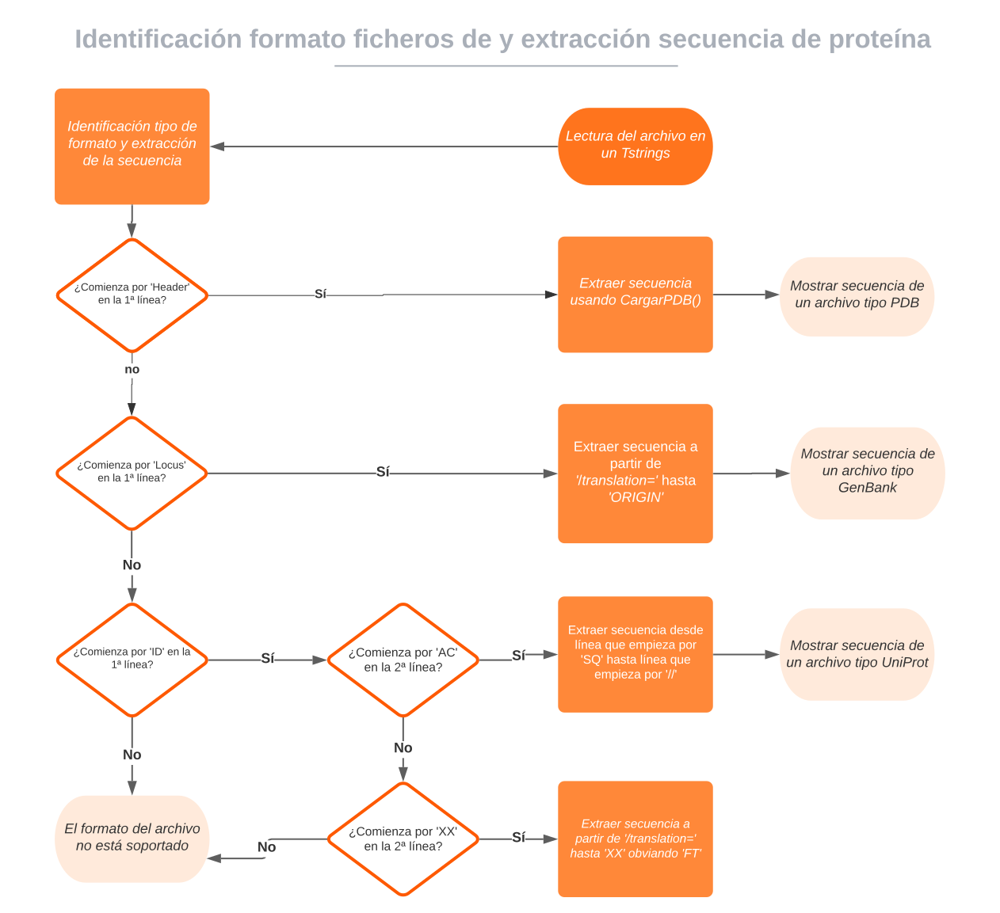

# Extraer secuencia distintos formatos

En la realización de este cuaderno de actividades se pide el desarrollo de un diagrama de flujo que permita identificar si un fichero tiene un formato EMBL, UniProt, GenBank, PDB o, si por el contrario, se encuentra en un formato no soportado. A partir de este diagrama y de las particularidades de cada formato se pide que se extraiga la secuencia de la proteína en cualquiera de estos 4 formatos de forma automática. A continuación se procede a mostrar de forma detallada el funcionamiento de la misma. El código correspondiente a esta funcionalidad se puede encontrar en la librería [biotools/src_biotools](https://github.com/currocam/biotools_hQC/blob/master/biotools/src_biotools.pas) y la implementación en un programa con interfaz gráfica en el repositorio bajo el nombre de [extraer_secuencia](https://github.com/currocam/biotools_hQC/tree/master/extraer_secuencia). Este apartado se corresponde a la 2ª actividad de la relación de ejercicios.

## Diagrama de flujo

En primer lugar, se consultó la bibliografía aportada y se realizó el siguiente diagrama de flujo, el cual de forma muy simplificada, muestra permitiría distinguir entre estos 4 formatos. La principal mejora que podría hacerse a este programa sería, precisamente, realizar un diagrama de flujo más complejo que tuviera en cuenta otras características además de la primera línea del archivo. Así, podrían detectarse archivos mal formateados.

||
|:--:|
|Figura 1. Diagrama de flujo para discriminar formato ficheros y extracción de secuencias. Elaboración propia.|


## Identificación del formato

Para realizar este programa se han realizado una serie de funciones que identifican, en base al diagrama de flujo anterior, el formato del archivo. Además, se ha utilizado la clase de Pascal `class(TTestCase)` para automatizar la realización de los test de este programa. Este desarrollo "modular" en base a funciones y acompañado de test es muy conveniente porque en caso de querer ampliar este programa a otros formatos, o mejorar los preexistentes, se puede trabajar en pequeñas unidades de código que funcionan independientemente y que se testean automáticamente. Destacar que otra ventaja de la realización de la función `isPDB` es que, gracias a su desarrollo independiente, fue añadida al inicio de las funciones que trabajaban con archivos de formato PDB. Las funciones escritas para identificar los formatos de los archivos son las siguientes:

=== "isEmbl()"

	```pascal linenums="1"
	function isEmbl(archivo: Tstrings): boolean;
	begin
	   if (copy(archivo[0],0,2)='ID') and (copy(archivo[1],0,2)='XX')
	   then result:= TRUE else result := FALSE;
	end;

	```
=== "isUniProt()"
	```pascal linenums="1"
	function isUniProt(archivo: Tstrings): boolean;
	begin
	   if (copy(archivo[0],0,2)='ID') and (copy(archivo[1],0,2)='AC')
	   then result:= TRUE else result := FALSE;
	end;
	```
=== "isGenBank()"
	```pascal linenums="1"
	function isGenBank(archivo: Tstrings): boolean;
	begin
	   if (copy(archivo[0],0,5)='LOCUS')
	   then result:= TRUE else result := FALSE;
	end;

	```
=== "isPDB()"
	```pascal linenums="1"
	function isPDB(archivo: Tstrings): boolean;
	begin
	   if (copy(archivo[0],0,6)= 'HEADER')
	   then result:= TRUE else result := FALSE;
	end;  
	```

## Leer secuencia de proteína

A continuación, se muestra la función que se escribió para extraer la secuencia de la proteína en cada uno de los formatos anteriores. Para escribirla se tuvo en cuenta las peculiaridades de cada formato en cuanto a dónde se encontraba la secuencia y, en el caso del archivo PDB, se utilizó la función `cargarPDB` que ya había sido desarrollada para el ejercicio siguiente.

??? example "Función leerSecuenciaProteina"
	```pascal linenums="1"
	function leerSecuenciaProteina(archivo: Tstrings): AnsiString;
	var
	   j,i: integer;
	   sec, linea: String;
	   p: TPDB;
	   check: boolean;
	begin
	   if(isPDB(archivo))then
	     begin
	     p:= CargarPDB(archivo);
	     result:= p.secuencia;
	     ShowMessage('Se ha detectado un archivo en formato PDB');
	   end
	else if(isGenBank(archivo)) then
	   begin
	     sec:='';
	     for j:= 0 to archivo.count-1 do
	     begin
	       linea:= archivo[j];
	       if copy(linea,0,6) = 'ORIGIN' then Break;
	       sec:= sec+ trim(linea);
	       if copy(linea,22,13) = '/translation=' then sec:= copy(linea, 35, 70);
	     end;
	     result:= trim(copy(sec,2,sec.Length-2));
	     ShowMessage('Se ha detectado un archivo en formato GenBank');
	   end
	   else if(isUniProt(archivo)) then
	     begin
		for j:= 0 to archivo.count-1 do
		begin
		  linea:= archivo[j];
		  if copy(linea,0,2) = '//' then Break;
		  sec:= sec+ trim(linea);
		  if copy(linea,0,2) = 'SQ' then sec:= '';
		end;
		result:= trim(sec);
		ShowMessage('Se ha detectado un archivo en formato UniProt');
	      end
	   else if(isEmbl(archivo)) then
	     begin
	       sec:='';
	       check:= FALSE;
	       for j:= 0 to archivo.count-1 do
	       begin
		 linea:= archivo[j];
		 if (copy(linea,0,2) = 'XX') AND check then Break;
		 sec:= sec+ trim(copy(linea, 22, 58));
		 if copy(linea,22,13) = '/translation=' then
		 begin
		   check:= TRUE;
		   sec:= copy(linea, 35, 39);
		   end;
	       end;
	       result:= trim(copy(sec,2,sec.Length-2));
	       ShowMessage('Se ha detectado un archivo en formato EMBL');
		 end

	   else
	      ShowMessage('Es un formato no soportado');
	end;          
	```

## TTestCase

Para la realización de los test empleados para este programa, se hizo uso de la clase `TTestCase` y del framework para unit testing `fpcunit` soportado por Lazarus. A continuación, mostramos a modo de ejemplo el código correspondiente para el procedimiento `Embl`, que realiza los test para las funciones relativas a este formato. El esquema seguido en este procedimiento es idéntico al resto:

1. Se cargan en variables tipo `TStringList` un archivo "modelo" para cada tipo de formato.
2. Se comprueba si el comportamiento de la función `isFormato()` es el esperado, es decir, que devuelve un valor True cuando se le da como argumento el fichero de dicho formato y un valor False para el resto.
3. Se comprueba que la secuencia que devuelve la función `leerSecuenciaProteina` es exactamente la esperada.

??? example "testing_biotools.Embl"
	```pascal linenums="1"
	procedure testing_biotools.Embl;
	var
	  SL_embl: TStringList;
	  SL_pdb: TStringList;
	  SL_UniProt: TStringList;
	  SL_GenBank: TStringList;
	  sec1, sec2: String;
	begin
	  SL_embl := TStringList.Create;
	  SL_pdb := TStringList.Create;
	  SL_UniProt:= TStringList.Create;
	  SL_GenBank := TStringList.Create;
	  SL_embl.LoadFromFile('text_embl.txt');
	  SL_pdb.LoadFromFile('text_PDB.txt');
	  SL_UniProt.LoadFromFile('text_UniProt.txt');
	  SL_GenBank.LoadFromFile('text_GenBank.txt');
	  IF not isEmbl(SL_embl) THEN Fail('No se ha detectado correctamente el archivo formato EMBL');
	  IF isEmbl(SL_pdb) THEN Fail('Se ha detectado erróneamente el formato EMBL con un pdb');
	  IF isEmbl(SL_UniProt) THEN Fail('Se ha detectado erróneamente el formato EMBL con un UniProt');
	  IF isEmbl(SL_GenBank) THEN Fail('Se ha detectado erróneamente el formato EMBL con un GenBank');
	  sec1 := 'MDFIVAIFALFVISSFTITSTNAVEASTLLDIGNLSRS' +
		 'SFPRGFIFGAGSSAYQFEGAVNEGGRGPSIWDTFTHKYPEKIRDGSNADITV' +
		 'DQYHRYKEDVGIMKDQNMDSYRFSISWPRILPKGKLSGGINHEGIKYYNNLI' +
		 'NELLANGIQPFVTLFHWDLPQVLEDEYGGFLNSGVINDFRDYTDLCFKEFGD' +
		 'RVRYWSTLNEPWVFSNSGYALGTNAPGRCSASNVAKPGDSGTGPYIVTHNQI' +
		 'LAHAEAVHVYKTKYQAYQKGKIGITLVSNWLMPLDDNSIPDIKAAERSLDFQ' +
		 'FGLFMEQLTTGDYSKSMRRIVKNRLPKFSKFESSLVNGSFDFIGINYYSSSY' +
		 'ISNAPSHGNAKPSYSTNPMTNISFEKHGIPLGPRAASIWIYVYPYMFIQEDF' +
		 'EIFCYILKINITILQFSITENGMNEFNDATLPVEEALLNTYRIDYYYRHLYY' +
		 'IRSAIRAGSNVKGFYAWSFLDCNEWFAGFTVRFGLNFVD';
	  sec2 := leerSecuenciaProteina(SL_embl);
	  IF not (sec2 = sec1) THEN Fail('No se ha leído la secuencia correctamente');
	end;        
	```
## Demostración de uso

Por último, se muestra una pequeña animación donde se muestra la implementación en una interfaz gráfica del código anterior.

||
|:--:|
|Figura 2. Animación con ejemplo de uso de la aplicación extraer secuencias.|
