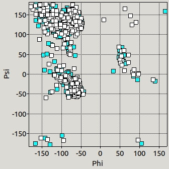

# Diagrama de Ramachandran

En la realización de este cuaderno de actividades se pide el desarrollo de una función que permita obtener los ángulos diedros de una proteína y su representación en un diagrama de Ramachandran. Para la elaboración de esta actividad se ha hecho uso del material impartido en clase en forma de apuntes. El código correspondiente a esta funcionalidad se puede encontrar en la librería [biotools/src_biotools](https://github.com/currocam/biotools_hQC/blob/master/biotools/src_biotools.pas) y la implementación en un programa con interfaz gráfica en el repositorio bajo el nombre de [ramachandran](https://github.com/currocam/biotools_hQC/tree/master/ramachandran). Este apartado se corresponde a la 6ª actividad de la relación de ejercicios.

## Ángulos de torsión

Los ángulos de torsión característicos de una proteína son los ángulos $\psi$ y $\phi$ y se pueden calcular para todos os residuos de una proteína excepto el primero y último.

|  |
|:------------------------------------------------------------------------------------------------------------------------------------------------------------------------------------------------------------------:|
| Figura 1. Representación de los ángulos de torsión (Golden et al., 2017) [^1].|

A continuación, se muestran las funciones desarrolladas, `angulo()` y  `torsion()`  ,para calcular el ángulo diedro (según las convenciones IUPAC de signo) para 4 puntos en el espacio (definidos en el `record TPunto`. Estas funciones se basan en que podemos calcular el ángulo diedro formado por 4 puntos en el espacio, $A$, $B$, $C$ y $D$, como el ángulo que forman entre si los vectores $V_1$ y $V_2$, resultantes del producto vectorial $\vec{BC}\times \vec{BA}$ y $\vec{CD}\times \vec{CB}$, respectivamente. Además, este ángulo diedro debe de corregirse después en signo para adecuarse a las convenciones IUPAC.

=== "angulo (A, B: Tpunto)"

	```pascal linenums="1"
    	function angulo (A, B: Tpunto): real;
	var
	   denominador: real;
	begin
	  denominador:= modulo(A)*modulo(B);
	if denominador > 0
	 then  result:= arccos(A*B/denominador)
	 else  result:=  maxfloat;
	end;

	```
=== "angulo(A, B, C: TPunto)"
	```pascal linenums="1"
	function angulo(A, B, C: TPunto):real; overload;
	var
	   BA,BC: TPunto;
	begin
	   BA:= A-B;
	   BC:= C-B;
	   result:= angulo( BA, BC);
	end;

	```
=== "torsion ( A, B, C, D: TPunto)"
	```pascal linenums="1"
	function torsion ( A, B, C, D: TPunto): real;
	var
	   BA, BC, CB, CD, V1, V2, P: TPunto;
	   diedro, diedro_IUPAC, denominador, cosenoGamma: real;
	begin
	     diedro_IUPAC:=0;
	   BA:= A- B;
	   BC:= C-B;
	   CB:= B-C;
	   CD:= D-C;
	   V1:= prodVectorial(BC, BA);
	   V2:= prodVectorial(CD, CB);
	   diedro:= angulo(V1, V2);
	   P:= prodVectorial(V2, V1);
	   denominador:= modulo(P)* modulo(CB);
	   if denominador >0 then
	   begin
	    cosenoGamma:= P* CB/ denominador;
	    if cosenoGamma >0 then cosenoGamma:=1 else cosenoGamma:=-1;
	   end else diedro_IUPAC:= maxfloat;
	   if diedro_IUPAC < maxfloat then diedro_IUPAC:= diedro*cosenoGamma;
	   result:=diedro_IUPAC;
	end;
	```


## Diagrama de Ramachandran
Los diagramas de Ramachandran son representaciones de los ángulos de torsión de los residuos de una proteína y son de gran interés puesto que es posible predecir la estructura secundaria de una proteína en base a los pares de valores $\psi$ y $\phi$ que tengan. Además, nos da información sobre la calidad de una estructura tridimensional, puesto que valores que se alejen de aquellas zonas que se consideran "normales" son indicativo de un posible error en la estructura.

||
|:--:|
|Figura 2. Diagrama de Ramachandran. Obtenido de Wikipedia [^2].|

### Aplicación Free Pascal/Lazarus

Para la realización de este programa fue necesario escribir la función `PlotXY` utilizando la clase `Canvas`. No entraremos en detalles en el funcionamiento de esta función puesto que fue desarrollada en clase. Además, para obtener un gráfico de mayor calidad y con ejes, utilizamos también la clase `TChart` que facilita la realización de gráficos. Hemos querido mantener el gráfico original para mostrar cómo nuestro 'módulo gráfico' funciona de manera muy parecida a una clase desarrollada de manera rigurosa. El procedimiento empleado en el programa para realizar ambos gráficos y escribir los resultados en formato de de tabla se puede ver a continuación:

???+ example "Procedimiento Diagrama de Ramachandran"
	```pascal linenums="1"
	procedure TForm1.ButtonClick(Sender: TObject);
	var
	  j, k, counter_col: integer;
	  datos : TTabladatos;
	  borrar: boolean;
	begin
	    memo2.clear;
	  for j:= 1 to p.NumSubunidades do
	  begin
	     counter_col:= -1;
	     borrar:= CheckBox1.Checked;
	     setLength(datos, 2,  p.sub[j].resCount -2);
	     memo2.visible:=false;
	     Image1.Visible:=false;
	     if borrar then Chart1LineSeries1.Clear();
	     for k:=p.sub[j].res1+1 to p.sub[j].resn-1 do
	     begin
	        counter_col:= counter_col +1;
	        memo2.lines.add(padright(p.res[k].ID3 + inttostr(p.res[k].NumRes) + p.res[k].subunidad, 10)
	                       + padleft(formatfloat('#.##',p.res[k].phi*180/pi),10)
	                       + padleft(formatfloat('#.##',p.res[k].psi*180/pi),10));
	        datos[0, counter_col]:= p.res[k].phi*180/pi;
	        datos[1, counter_col]:= p.res[k].psi*180/pi;
	        // Añadimos a gráfico con ejes
	        Chart1LineSeries1.AddXY(datos[0, counter_col], datos[1, counter_col],'', colorBox2.Selected);
	     end;
	     plotXY(datos, Image1,
	                   0,        //OX
	                   1,        //OY
	                   borrar,    //borrar
	                   false,    //linea
	                   colorBox1.Selected,   //clpluma
	                   colorBox2.Selected,   //clrelleno
	                   colorBox3.Selected);  //Tcolor
	     memo2.visible:=true;
	     Image1.Visible:=true;
	     Chart1.BottomAxis.Visible:= TRUE;
	     Chart1.BottomAxis.Visible:= TRUE;
	     Chart1LineSeries1.ShowPoints:=TRUE;
	     Chart1LineSeries1.LineType:=ltNone;
	end;
	end;
	```

### Demostración de uso

A continuación, se muestra en una animación la implementación de estas funciones en una interfaz gráfica dentro del programa `Ramachandran`.

|  |
|:--------------------------------------------------------------------------:|
| Figura 3. Animación del programa `Ramachandran` mostrando su uso.          |

## Comparación de los ángulos de torsión de distintas estructuras de hQC

### Ángulos de torsión de referencia

En primer lugar, vamos a comparar los ángulos de torsión calculados por nuestro programa con los valores de referencia que obtengamos por una aplicación profesional. Por un lado, vamos a calcular los ángulos de torsión para los residuos 34-40 de nuestra estructura 2AFM usando la aplicación desarrollada. Y, por otro lado, vamos a emplear como referencia los ángulos de torsión calculados por la aplicación [Torsion angles](https://swift.cmbi.umcn.nl/servers/html/chiang.html) para la misma proteína. Como puede observarse en la Tabla 1, los valores son enormemente parecidos, diferenciándose únicamente debido a distintos criterios de redondeo.

| Número de residue 	| Residuo 	| $\phi_{\text{ref}}$ 	| $\phi_{\text{calculado}}$ 	| $\psi_{\text{ref}}$ 	| $\psi_{\text{calculado}}$ 	|
|:---:	|:---:	|:---:	|:---:	|:---:	|:---:	|
| 34 	| SER 	| -41.80 	| -41.77 	| 138.20 	| 138.19 	|
| 35 	| ALA 	| -98.40 	| -98.42 	| 22.50 	| 22.48 	|
| 36 	| TRP 	| -59.90 	| -59.89 	| -31.10 	| -31.05 	|
| 37 	| PRO 	| -67.90 	| -67.86 	| -9.00 	| -9.03 	|
| 38 	| GLU 	| -89.60 	| -89.61 	| -10.40 	| -10.38 	|
| 39 	| GLU 	| -55.90 	| -55.90 	| -37.10 	| -37.10 	|
| 40 	| LYS 	| -56.70 	| -56.73 	| -28.00 	| -28.00 	

Tabla 1. Comparación de los ángulos de torsión calculados frente a un valor de referencia para la proteína 2AFM.

## Comparación diagrama de Ramachandran

En segundo lugar, vamos a comparar la estructura experimental 2AFW, que corresponde a la enzima hQC formando un complejo con N-acetilhistamina, uno de sus sustratos, con Q16769 de AlphaFold, que corresponde a la estructura nativa de la isoforma secretora. Para ello, hemos generado la siguiente representación donde se muestran los residuos de 2AFW dibujados en azul y los de AlphaFold dibujados en blanco. En un principio, esperaríamos que ambas estructuras fueran muy similares, pero se diferenciaran en unos pocos residuos:

1. Aquellos residuos que forman la secuencia N-terminal de Q16769, responsable de su anclaje en el aparato de Golgi.
2. Aquellos residuos que forman el sitio activo de la proteína y que está ligeramente más abierta en Q16769 que en 2AFW.
3. Aquellos residuos de 2AFW que se hubieran visto afectados por la interacción  de la enzima con su sustrato. Destacar que sería interesante también comparar 2AFM (sin sustrato) con 2AFW (con sustrato) para poder "aislar" el efecto de la unión del sustrato a la enzima. Dicha imagen se puede observar en uno de los frames de la Figura 3, en la cual se puede ver cómo ambos diagramas se superponen casi a la perfección.

|                                                                                               |
|:-------------------------------------------------------------------------------------------------------------------------------------------------------:|
| Figura 4. Representación esquemática del diagrama de Ramachandran para la proteína experimental 2AFM comparada con la proteína predecida por AlphaFold. |

En general, la agrupación de los residuos dentro del diagrama concuerda con lo revisado en literatura a cerca de la estructura secundaria. Si comparamos la Figura 4 con la Figura 2, rápidamente podemos ubicar los residuos que forman parte de hebras $\beta$ en la esquina superior izquierda, de hélices $\alpha$ en el grupo de puntos debajo de este y en el lado derecho una nube de puntos que podría corresponderse con hélices con giro a la izquierda. Además, la mayor parte de los puntos se encuentran en regiones no prohibidas estéricamente, lo cual nos da una idea de la calidad de ambas estructuras.

##	 Conclusión

En conclusión, el programa y las funciones desarrolladas son capaces de, en primer lugar, calcular los ángulos de torsión para una estructura de forma adecuada y muy precisa, al compararla con herramientas profesionales.  Y , en segundo lugar, la interfaz y el módulo gráfico nos permiten analizar dichos resultados para comparar estructuras y , por ejemplo, observar el efecto que tiene en la estructura la unión de una molécula de interés biológico (como un sustrato o un inhibidor, para estudiar la catálisis enzimática). Esta idea también sería aplicable para comparar las diferencias estructurales entre una proteína nativa y con alguna mutación.


## Referencias
[^1]: Golden, M., García-Portugués, E., Sørensen, M., Mardia, K. V., Hamelryck, T., & Hein, J. (2017). A Generative Angular Model of Protein Structure Evolution. Molecular Biology and Evolution, 34(8), 2085-2100. https://doi.org/10.1093/molbev/msx137
.
[^2]: Imagen elaborada por Dcrjsr y obtenida a través de Wikipedia.
