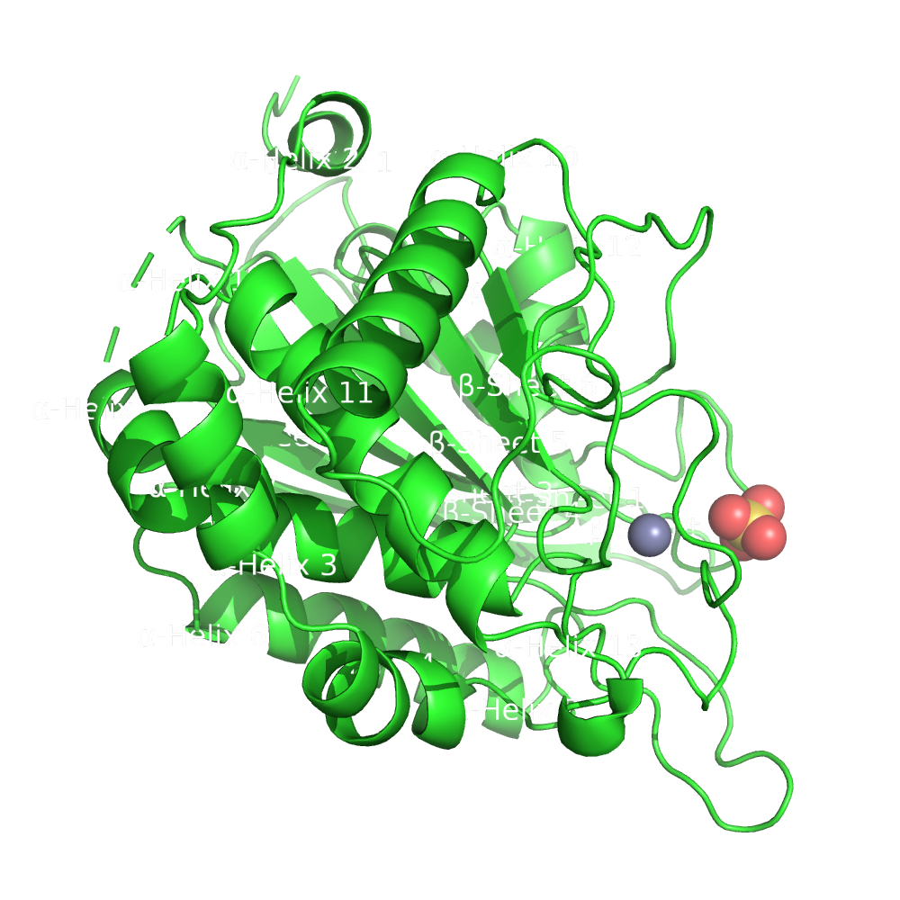

## Revisión bibliográfica

A continuación, desarrollamos una breve revisión bibliográfica sobre la proteína hQC, haciendo especial énfasis en los aspectos estructurales y funcionales de la misma. Este apartado se corresponde a la 1ª actividad de la relación de ejercicios.

### Metodología

En la realización de esta revisión bibliográfica se hizo uso de la base de datos Scopus para la selección de un grupo reducido de revisiones y artículos de interés que trataran sobre esta proteína. También se recurrió la base de datos RCSB PDB para la búsqueda de estructuras experimentales disponibles para esta proteínas, cuyas características principales se encuentran resumidas más adelante.

### Introducción

La enzima hQC (Human glutaminyl cyclase)  pertenece a una familia de aciltransferasas muy extendidas en animales y plantas. Su importancia reside en que también interviene en la formación de piroglutamato N-terminal (pGlu) a partir de su precursor glutaminilo, la cual se pensaba que sucedía de manera espontánea. Esta reacción es una modificación postraduccional de importancia en la maduración de  numerosos neuropéptidos bioactivos, hormonas y citoquinas, durante su maduración en la vía secretora y es objeto de estudio en relación a patologías como la osteoporosis y el Alzheimer (Gunn et al., 2021) [^1].

[^1]: Gunn, A. P., Wong, B. X., McLean, C., Fowler, C., Barnard, P. J., Duce, J. A., Roberts, B. R., & The AIBL Research Group. (2021). Increased glutaminyl cyclase activity in brains of Alzheimer’s disease individuals. Journal of Neurochemistry, 156(6), 979-987. https://doi.org/10.1111/jnc.15114.


Se conocen dos isoformas de la enzima QC en *Homo sapiens*, la llamada QC secretora, sQC, codificada por el gen QPCT localizado en el cromosoma 2p22.2, y la llamada QC golgi residente, gQC, codificada por el gen QPCTL, en el cromosoma 19q13.32 (Huang et al., 2005) [^2].

[^2]: Huang, K.-F., Y.-L. Liu, W.-J. Cheng, T.-P. Ko, y A. H.-J. Wang. «Crystal Structures of Human Glutaminyl Cyclase, an Enzyme Responsible for Protein N-Terminal Pyroglutamate Formation». Proceedings of the National Academy of Sciences 102, n.º 37 (13 de septiembre de 2005): 13117-22. https://doi.org/10.1073/pnas.0504184102.


### Aspectos estructurales de importancia

Ambas enzimas, sQC y gQC, tienen una estructura muy similar, por lo que las consideraciones generales que podamos hacer sobre su estructuras serán aplicables a ambas isoformas. Poseen una estructura globular con un pliegue mixto α/β. La actividad glutaminil y glutamil ciclasa reside en el dominio maduro (residuos 33-361) de la proteína [^1]


||
|:--:|
|Figura 1. Dominio maduro anotado con las estructuras secundarias según el orden del archivo 2AFM.pdb. Elaboración propia usando PyMOL. En el apartado de visualización se aborda en detalle la realización de estas imágenes.|

La estructura posee una topología de sándwich abierto con una lámina β central de seis hebras rodeada por  α-hélices a ambos lados. Estas  α-hélices son α7 y α9 y α2, α3, α4, α5, α6, y α10, respectivamente. Esta lámina β central  esta formada por dos hebras antiparalelas (β1 y β2) y 4 paralelas (β3, β4, β5 y β6) y constituye el corazón hidrofóbico de la molécula (Huang et al., 2005) [^2].


#### Estructura del sitio activo

El sitio activo está formado por 6 bucles entre α3 y α4, β3 y α5, β4 y α7, β5 y α8, α8 y α9, y β6 y α10. Consta de un ión de zinc situado en el bolsillo del sitio activo y que está coordinado tetraédricamente con D159 Oδ2, E202 Oε1, H330 Nε2 y una molécula de agua. También resultan de interés una serie de residuos altamente conservados en el entorno del zinc a los que se les atribuye en literatura cierto papel en la catálisis. Estos residuos son E201, W207, D248, D305, F325 y W329 y se ha comprobado que mutaciones en estos aminoácidos reducen significativamente la actividad enzimática (Gunn et al., 2021) [^1].

#### Estructuras experimentales disponibles

En el momento en que se realiza esta revisión hay un total de 31 estructuras experimenales depositadas en el RCSB PDB. Muchas de ellas corresponden a proteínas mutantes o cristalizadas en presencia de su inhibidor, debido al interés clínico de esta molécula. Para realizar este trabajo hemos escogido la proteína 2AFM, la cual posee una buena resolución y corresponde a la proteína *wild type*. No obstante, en algunas actividades se ha decidido otras estructuras de esta proteína con el objetivo de realizar una comparación o de comprobar si los programas utilizados funcionaban con otras estructuras de la misma proteína.

??? example "Tabla 1. Resultados búsqueda en RCSB PDB. Elaboración propia."
	|PDB ID|Resolution (Å)|R Free |R Work |Space Group|Length a (Å)|Length b (Å)|Length c (Å)|Structure Title                                                                                          |
	|:----:|:------------:|:-----:|:-----:|:---------:|:----------:|:----------:|:----------:|:-------------------------------------------------------------------------------------------------------:|
	| 2AFW |     1.56     | 0.213 | 0.189 |   H 3 2   |  119.132   |  119.132   |  332.826   |             Crystal structure of human glutaminyl cyclase in complex with N-acetylhistamine             |
	| 2AFX |     1.64     | 0.205 | 0.177 |   H 3 2   |  119.013   |  119.013   |  332.821   |             Crystal structure of human glutaminyl cyclase in complex with 1-benzylimidazole             |
	| 2AFM |     1.66     | 0.204 | 0.182 |   H 3 2   |  119.029   |  19.029   |  332.938   |                         Crystal structure of human glutaminyl cyclase at pH 6.5                         |
	| 2ZEO |     1.66     | 0.194 | 0.175 |   H 3 2   |  119.226   |  119.226   |  332.457   |       Crystal structure of the human glutaminyl cyclase mutant D305E at 1.66 angstrom resolution        |
	| 6YJY |     1.67     |0.1884 |0.1694 |   H 3 2   |  119.274   |  119.274   |  334.459   |              Crystal structure of human glutaminyl cyclase in complex with neurotensin 1-5              |
	| 2ZEF |     1.67     | 0.208 | 0.185 |   H 3 2   |  119.161   |  119.161   |  333.064   |       Crystal structure of the human glutaminyl cyclase mutant E201D at 1.67 angstrom resolution        |
	| 2AFZ |     1.68     | 0.212 | 0.186 |   H 3 2   |  118.953   |  118.953   |  332.997   |             Crystal structure of human glutaminyl cyclase in complex with 1-vinylimidazole              |
	| 7CP0 |     1.7      |0.2228 |0.2054 |  C 1 2 1  |   86.277   |  149.383   |   96.032   |            Crystal Structure of double mutant Y115E Y117E human Secretory Glutaminyl Cyclase            |
	| 2ZED |     1.7      | 0.213 | 0.18  |   H 3 2   |  118.926   |  118.926   |  332.499   |        Crystal structure of the human glutaminyl cyclase mutant S160A at 1.7 angstrom resolution        |
	| 6GBX |     1.72     |0.18307|0.15819|  C 1 2 1  |   86.14    |   149.81   |   95.98    |        Crystal structure of human glutaminyl cyclase variant Y115E-Y117E in complex with SEN177         |
	| 2ZEN |     1.78     | 0.205 | 0.178 |   H 3 2   |  119.237   |  119.237   |  332.405   |       Crystal structure of the human glutaminyl cyclase mutant D305A at 1.78 angstrom resolution        |
	| 3SI2 |     1.8      |0.2597 |0.1844 |P 21 21 21 |   41.76    |   83.06    |   95.71    |     Structure of glycosylated murine glutaminyl cyclase in presence of the inhibitor PQ50 (PDBD150)     |
	| 2ZEH |     1.8      | 0.207 | 0.181 |   H 3 2   |  119.051   |  119.051   |  332.652   |        Crystal structure of the human glutaminyl cyclase mutant E201Q at 1.8 angstrom resolution        |
	| 7COZ |     1.85     |0.2362 |0.1955 |  C 1 2 1  |   86.229   |  149.366   |   95.377   |Crystal Structure of double mutant Y115E Y117E human Secretory Glutaminyl Cyclase in complex with LSB-41 |
	| 6YI1 |     1.92     |0.1862 |0.1593 |   H 3 2   |   120.38   |   120.38   |   331.91   |       Crystal structure of human glutaminyl cyclase in complex with Glu(gamma-hydrazide)-Phe-Ala        |
	| 3PBB |     1.95     |0.23892|0.18107|    H 3    |  155.753   |  155.753   |   80.516   |             Crystal structure of human secretory glutaminyl cyclase in complex with PBD150              |
	| 4YWY |     1.95     |0.21101|0.16408|  C 1 2 1  |   86.429   |   149.54   |   96.21    |Crystal Structure of double mutant Y115E Y117E human Glutaminyl Cyclase in complex with inhibitor PBD-150|
	| 3PBE |     1.95     |0.1904 |0.14264|   H 3 2   |  118.754   |  118.754   |  332.093   |               Crystal structure of the mutant W207F of human secretory glutaminyl cyclase               |
	| 2ZEL |     1.97     | 0.218 | 0.176 |   H 3 2   |   119.11   |   119.11   |   332.35   |       Crystal structure of the human glutaminyl cyclase mutant D248A at 1.97 angstrom resolution        |
	| 2ZEE |     1.99     | 0.219 | 0.176 |   H 3 2   |   119.12   |   119.12   |  332.006   |       Crystal structure of the human glutaminyl cyclase mutant S160G at 1.99 angstrom resolution        |
	| 2ZEG |     2.08     | 0.209 | 0.177 |   H 3 2   |  119.392   |  119.392   |  333.193   |       Crystal structure of the human glutaminyl cyclase mutant E201L at 2.08 angstrom resolution        |
	| 4YU9 |     2.1      |0.2542 |0.21079|  C 1 2 1  |   86.38    |   149.63   |    96.3    |                 Crystal Structure of double mutant Y115E Y117E human Glutaminyl Cyclase                 |
	| 2ZEP |     2.1      | 0.219 | 0.179 |   H 3 2   |  119.543   |  119.543   |  334.021   |        Crystal structure of the human glutaminyl cyclase mutant H319L at 2.1 angstrom resolution        |
	| 3SI0 |     2.1      |0.26358|0.20382|  C 1 2 1  |   82.408   |   63.688   |   77.159   |                           Structure of glycosylated human glutaminyl cyclase                            |
	| 2ZEM |     2.18     | 0.223 | 0.179 |   H 3 2   |  118.778   |  118.778   |   332.5    |       Crystal structure of the human glutaminyl cyclase mutant D248Q at 2.18 angstrom resolution        |
	| 2AFU |     2.22     | 0.226 | 0.188 |   H 3 2   |  119.137   |  119.137   |  332.612   |          Crystal structure of human glutaminyl cyclase in complex with glutamine t-butyl ester          |
	| 2AFS |     2.22     | 0.222 | 0.189 |   H 3 2   |  119.447   |  119.447   |  333.848   |                Crystal structure of the genetic mutant R54W of human glutaminyl cyclase                 |
	| 2AFO |     2.35     | 0.216 | 0.185 |   H 3 2   |  118.988   |  118.988   |  332.258   |                         Crystal structure of human glutaminyl cyclase at pH 8.0                         |
	| 3SI1 |     2.9      |0.3006 |0.2451 |P 21 21 21 |   43.24    |   86.87    |   97.16    |                           Structure of glycosylated murine glutaminyl cyclase                           |


### Mecanismo de acción de hQC

Las QCs median la ciclación de la glutamina o glutamato expuestos en el N-terminal con liberación de agua o amoniaco. Para iniciar dicha ciclación, el ion $Zn^{2+}$ localizado en el sitio activo polariza el grupo γ-amino del residuo y estabiliza el anión resultante del ataque nucleofílico sobre el carbono γ-carbonílico. En este mecanismo intervienen también E201 y D248 apoyando la transferencia de protones y aportando estabilidad (Gunn et al., 2021) [^1].

||
|:--:|
|Figura 2. Mecanismo de acción de la enzima hQC. Obtenido de Huang et al., 2005 [^2].|

A continuación, se muestra un detalle del sitio de unión de la proteína. Se pueden observar los residuos que se destacan anteriormente. Para realizar esta imagen se han seleccionado los átomos de hasta una distancia de 5 A del cofactor del sitio catalítico y se han realizado anotaciones sobre los carbonos alfa.


||
|:--:|
|Figura 3. Detalle del sitio de unión de la estructura 2AFM. Elaboración propia. |

El código en Python empleado para realizar la Figura 3 es el siguiente:

```python
set ray_opaque_background, off
load data/processed/2AFM.pdb
remove solvent
select sitio_union, byres res 392 expand 5
remove (not sitio_union)
hide cartoon
show sticks
zoom sitio_union
label n. CA and sitio_union, "(%s, %s)" % (resn, resi)

python
import imageio
cmd.ray(500, 500)
filename = "sitio_union"+".png"
cmd.png(filename)
python end
```

## Referencias
