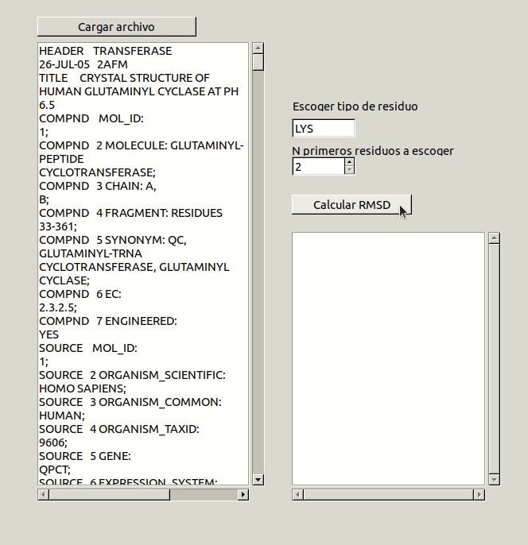

# RMSD

En la elaboración de este cuaderno de actividades se pide el desarrollo de una aplicación capaz
En la realización de este cuaderno de actividades se pide el desarrollo de una aplicación capaz  de calcular el RMSD o desviación cuadrática media de una serie de residuos determinados por el usuario. El código correspondiente a las funciones utilizadas se encuentran en la librería [biotools/src_biotools](https://github.com/currocam/biotools_hQC/blob/master/biotools/src_biotools.pas) y la aplicación bajo el nombre de [RMSD](https://github.com/currocam/biotools_hQC/tree/master/rmsd). Este apartado se corresponde a la 9ª actividad de la relación de ejercicios.

## Calcular RMSD

A continuación, mostramos la definición de RMSD.

$$
RMSD = \sqrt{\frac{\sum^{n}_{i, j}(Dist1_{i,j}-Dist2_{i,j})^2}{n}}
$$

Antes de desarrollar una función capaz de calcular el RMSD para una serie de puntos necesitaremos definir una serie de funciones que nos harán falta. En primer lugar, definiremos una función que calcule la distancia entre dos puntos en el espacio.

=== "Distancia (coordenadas)"

	```pascal linenums="1"
	function distancia3D(a1, b1, c1, a2, b2, c2: real): real;
	  begin
	  result :=sqrt(sqr(a1-a2)+sqr(b1-b2)+sqr(c1-c2));
	  end;

	```
=== "Distancia (TPunto)"

	```pascal linenums="1"
	function distancia3D(p1, p2: Tpunto): real; overload;
	begin
	result :=sqrt(sqr(p1.X-p2.X)+sqr(p1.Y-p2.Y)+sqr(p1.Z-p1.Z));
	end;
	```

El siguiente paso consiste en crear una función capaz de generar una matriz con las distancias internas entre todos los átomos de un residuo. Una de las mejoras que se han implementado es que, aunque el ejercicio pedía inicialmente una función capaz de calcular el RMSD entre distintas serinas, hemos querido generalizar un poco más, obteniendo una función que calcula la matriz de distancias entre un conjunto de átomos cual sea, independientemente del número de puntos. De esta forma, dado un conjunto de $n$ puntos en el espacio, esta función devuelve una matriz de dimensiones $n\times n$. Esta matriz contiene en la posición $M_{i, j}$ la distancia entre los puntos $p_i$ y $p_j$. Destacar que, al ser una matriz de distancias, la diagonal de la matriz debe estar compuesta únicamente por ceros.

??? example "matriz_distancias()"
	```pascal linenums="1"
	function matriz_distancias (puntos: TPuntos): ;
	var
	matriz : MatrizDistancias;
	i, j, n : integer;
	begin
	 n:= high(puntos)+1,
	 SetLength(matriz, n, n);
	   for i:= 0 to n do  
	      for j:= 0 to n do  
		 matriz[i,j]:= distancia3D(puntos[i], puntos[j]);
	end;
	```
A continuación, se desarrolló una función que recibiera como argumento dos matrices de distancias y que fuese capaz de calcular el RMSD entre los dos conjuntos de puntos a los que pertenecen dichas matrices de distancia.  
??? example "RMSD_distan()"
	```pascal linenums="1"
	function RMSD_distan (dist1, dist2: Matriz2D): real;
	var
	   sumatorio: real;
	   i, j, n : integer;
	begin
	sumatorio := 0;
	n:= high(dist1);
	   for i:= 0 to n do
	   begin
	      for j:= 0 to n do
	      begin
	         sumatorio:= sumatorio + sqr(dist1[i, j] - dist2[i, j]);
	      end;
	   end;
	   result := sqrt(sumatorio/n);
	end;
	```

## Aplicación Free Pascal/Lazarus
Por último, se muestra la implementación de las funciones anteriores en una aplicación Free Pascal/Lazarus. Esta aplicación tiene una interfaz gráfica que permite al usuario elegir el tipo y número de residuos a estudiar. Una posible mejora de este programa sería una lograr una interfaz más sofisticada para que el usuario elija los residuos en que está interesado. El procedimiento principal de dicha aplicación es complejo y se muestra a continuación porque nos resulta interesante como, a partir de las funciones anteriores, se construye una matriz bidimensional con los resultados y se imprimen por pantalla en un formato adecuado. Dicha matriz es una matriz $r \times r$, donde $r$ es el número de residuos a comparar y donde $M_{i,j, \text{result}} = RMSD(r_i, r_j)$.

### Demostración de uso

Mostramos a continuación una animación mostrando el funcionamiento de la aplicación. Destacar que funciona con distintos tipos de residuos (es decir, es capaz de dimensionar adecuadamente las matrices de distancias) y con distinto número de residuos (es decir, también es capaz de dimensionar adecuadamente la matriz de resultados que contiene los valores de RMSD para distintos pares de residuos).

||
|:-----------------------------------------------------------------------------:|
| Figura 1. Animación del programa `RMSD` mostrando su uso.|

## Análisis serinas de hQC

A continuación, mostramos los resultados de nuestro programa al calcular los valores de RMSD por pares para las 4 primeras serinas de la proteína, que son los residuos 34, 50, 61 y 63. 	

$$
\text{Pairwise RMSD} = \begin{pmatrix}0.000 & 1.859 & 0.983 & 1.312\\
1.859 & 0.000 & 1.708 & 1.682\\
0.983 & 1.708 & 0.000 & 1.001\\
1.312 & 1.682 & 1.001 & 0.000\end{pmatrix}
$$

Como se puede observar, el segundo residuo de serina, S50, es el más distinto al resto, teniendo los valores más elevados de RMSD. El tercer y cuarto residuo,S62 y S63, tienen valores bajos de RMSD, lo cual podría explicarse con el hecho de que, al estar tan cerca, probablemente tengan entornos químicos muy parecidos. Sin embargo, el par de residuos más similar es el primero, S34 y el tercero, S50. A continuación, se muestran en los 4 residuos anteriores anotados sobre la estructura de la proteína.  

||
|:-----------------------------------------------------------------------------:|
| Figura 2. Representación *cartoon* de la estructura de 2AFM obtenida con PyMol. Los residuos han sido anotados con su código de tres letras, su número de residuo y con el factor B. |

Por último, comentar que la información aportada por el RMSD es de gran interés puesto que nos permite determinar qué residuos podrían estar en entornos químicos más parecidos de forma numérica.
