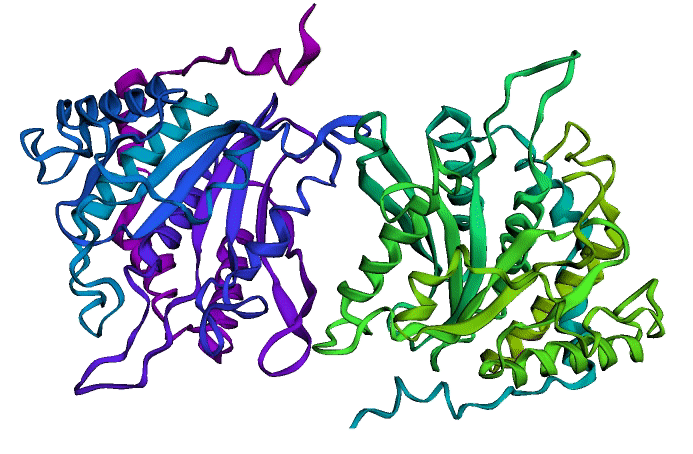
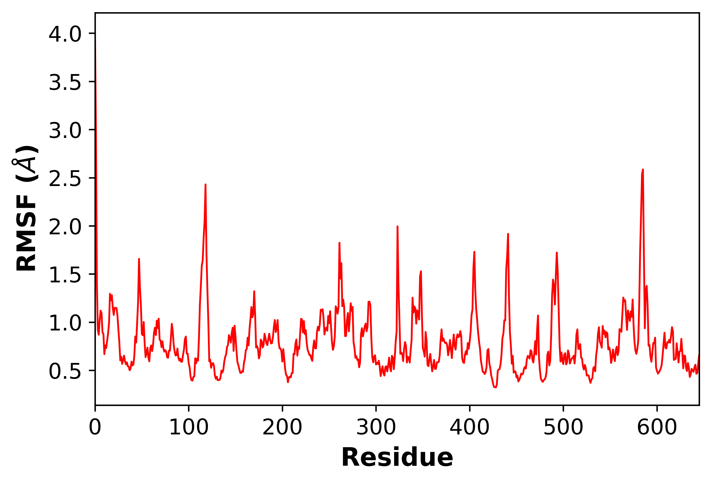
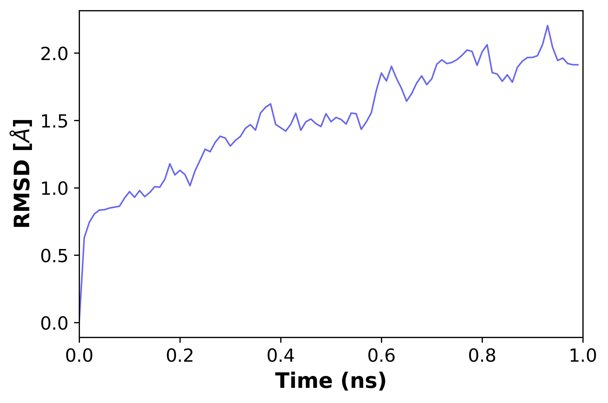

# Simulación de dinámica molecular

Las simulaciones de dinámica molecular (MD) predicen cómo se mueven cada átomo de una proteína a lo largo del tiempo en base a un modelo físico que estipula cómo son las interacciones interatómicas. Estas simulaciones se basan en la idea de que, dadas las posiciones de todos los átomos de im sistema (una proteína rodeada por agua, por ejemplo), es posible calcular la fuerza que es ejercida sobre cada átomo por el resto (a partir de un modelo complejo que se conoce como "molecular mechanics force field") y, usando las leyes de Newton, predecir la posición espacial de cada átomo en función del tiempo. El resultado de una simulación MD es una trayectoria que describe el movimiento de los átomos durante un intervalo.[@hollingsworthMolecularDynamicsSimulation2018b]

Como parte de la exploración de la proteína human glutaminyl cyclase, se realizó una simulación de MD utilizando el cuaderno alojado en Google Colab y propuesto en el artícuo [Making it Rain: Cloud-Based Molecular Simulations for Everyone](https://github.com/pablo-arantes/making-it-rain) [@arantesMakingItRain2021a].

Antes de llevar a cabo la simulación se realizaron los siguientes preparativos. : 

1. Se descargó la estructura 2AFM del PDB.
2. Se generó un archivo de topología empleando el software AMBER (esto es, un archivo que describe los tipos de átomos, las conectividades y otros parámetros necesarios para el force field).
3. Se añadieron moléculas de agua al modelo molecular creado a partir del PDB que solvataran la proteína y se neutralizó el sistema añadiendo iones.
4. Una vez se habían generado los dos ficheros que describían el sistema (el archivo de coordenadas y el de topología), se llevó a cabo una etapa de equilibración. Esto es el proceso por el cual se calcula y se descarta el segmento inicial  de la simulación hasta que se alcance un estado estacionario, puesto que los primeros cientos de picosegundos no suelen aportar información relevante. 

Esta simulación ha sido realizada con objetivos educativos pero, realizada de una forma más rigurosa y empleando mayor poder computacional, podría utilizarse para estudiar la estabilidad y flexibilidad conformacional de la estructura 2AFM. Podría usarse, por ejemplo, para el refinamiento del modelo estructural o la identificación de lazos muy flexibles o poco estables. A continuación se muestran los resultados de la misma.

| |
|:--:|
|Representación gráfica de la trayectoria utilizando py3Dmol|

A continuación, representamos los valores de RMSF para cada residuo (Root mean square fluctuation) y RMSD y de RMSD (root-mean-square deviation of atomic positions) a lo largo de la simulación.. Sería interesante analizar esta gráfica atendiendo a los dominios activos dela proteína y a los residuos que son de interés. 

||
|:--:|
|RMFS de los carbonos $\alpha$|

||
|:--:|
|RMSD de los carbonos $\alpha$|

## Referencias
\bibliography

