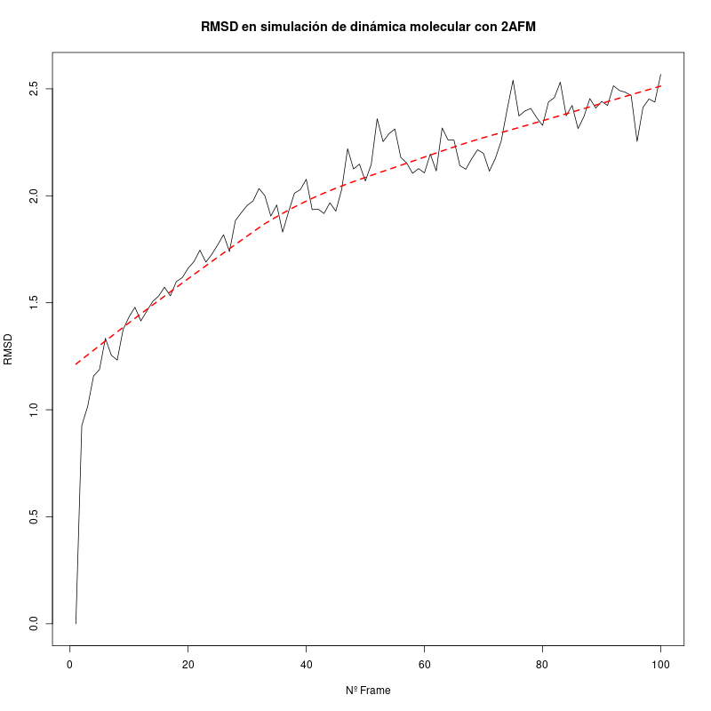
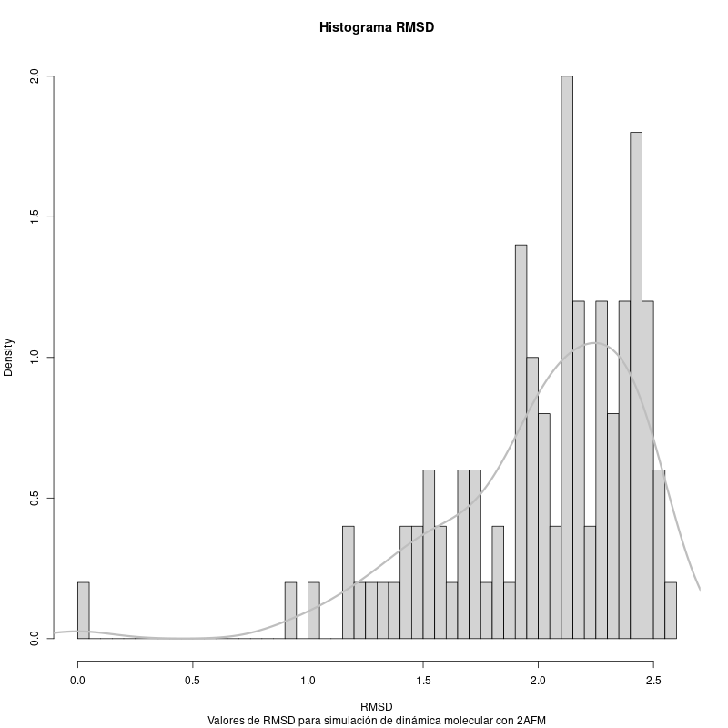
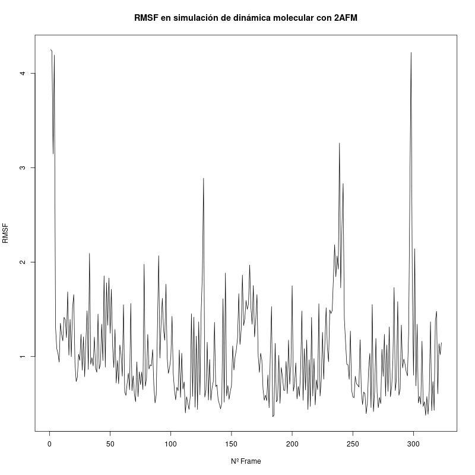
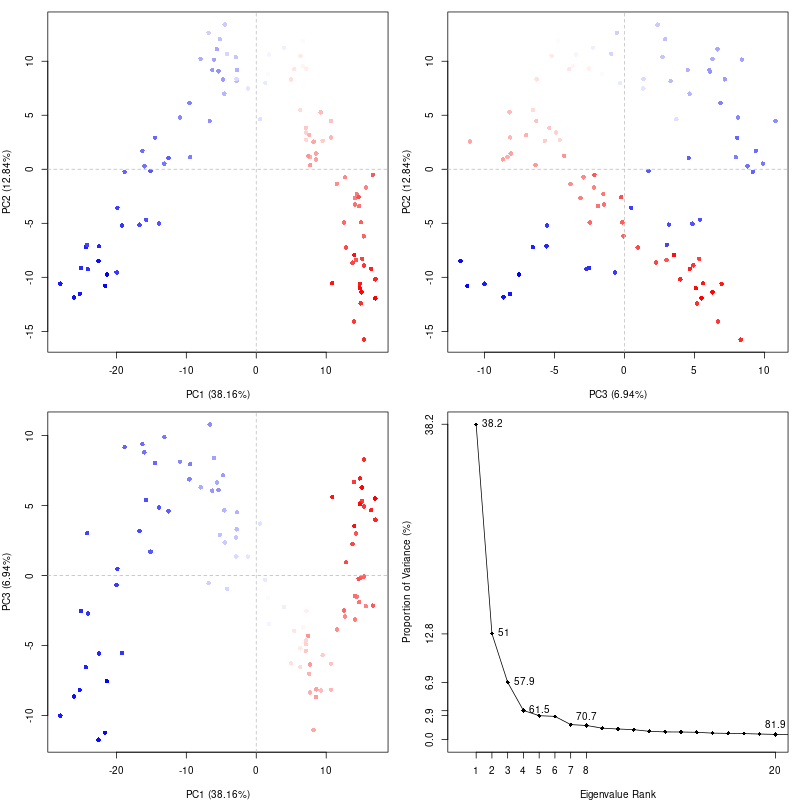
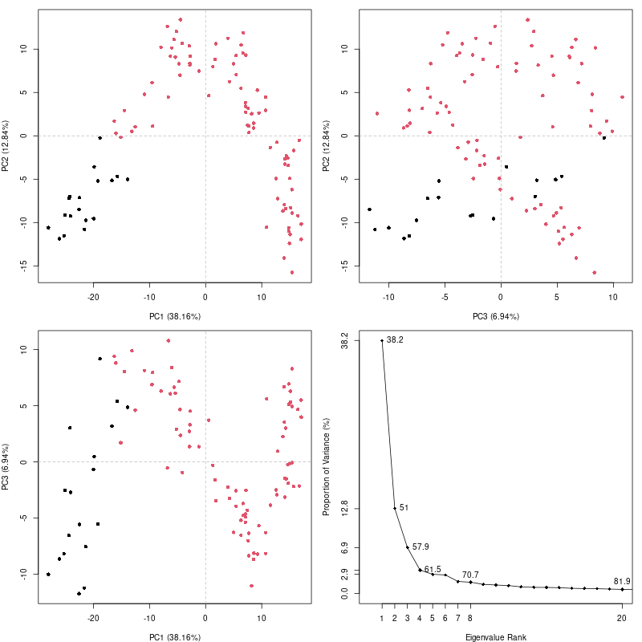
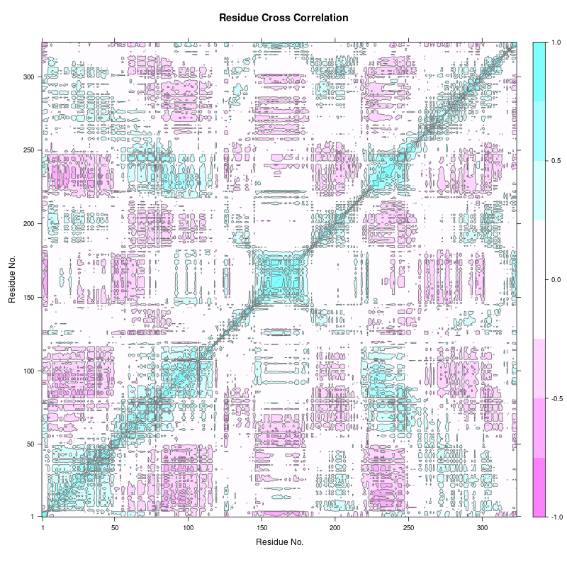
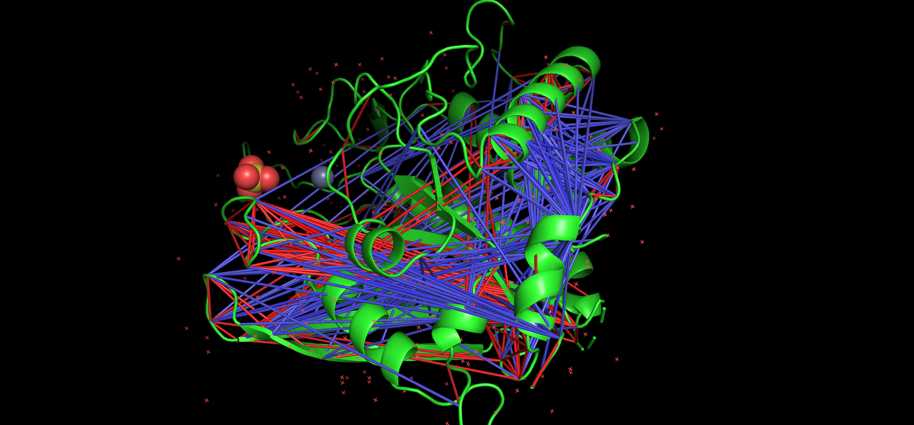

# Simulación de dinámica molecular (extra)

Las simulaciones de dinámica molecular (MD) predicen cómo se mueven cada átomo de una proteína a lo largo del tiempo en base a un modelo físico que estipula cómo son las interacciones interatómicas. Estas simulaciones se basan en la idea de que, dadas las posiciones de todos los átomos de un sistema (una proteína rodeada por agua, por ejemplo), es posible calcular la fuerza que es ejercida sobre cada átomo por el resto (a partir de un modelo complejo que se conoce como *molecular mechanics force field*) y, usando las leyes de Newton, predecir la posición espacial de cada átomo en función del tiempo. El resultado de una simulación MD es una trayectoria que describe el movimiento de los átomos durante un intervalo (Hollingsworth & Dror, 2018) [^3].

Como parte de la exploración de la proteína human glutaminyl cyclase, se realizó una simulación de MD utilizando el cuaderno alojado en Google Colab y propuesto en el artícuo [Making it Rain: Cloud-Based Molecular Simulations for Everyone](https://github.com/pablo-arantes/making-it-rain) (Arantes et al., 2021) [^1].

Antes de llevar a cabo la simulación se realizaron los siguientes preparativos. :

1. Se descargó la estructura 2AFM del [RCSB PDB](https://www.rcsb.org/).
2. Se generó un archivo de topología empleando el software AMBER (esto es, un archivo que describe los tipos de átomos, las conectividades y otros parámetros necesarios para el *force field*).
3. Se añadieron moléculas de agua al modelo molecular creado a partir del PDB que solvataran la proteína y se neutralizó el sistema añadiendo iones.
4. Una vez se habían generado los dos ficheros que describían el sistema (el archivo de coordenadas y el de topología), se llevó a cabo una etapa de equilibración. Esto es el proceso por el cual se calcula y se descarta el segmento inicial  de la simulación hasta que se alcance un estado estacionario, puesto que los primeros cientos de picosegundos no suelen aportar información relevante.

Esta simulación ha sido realizada con objetivos educativos pero, realizada de una forma más rigurosa y empleando mayor poder computacional, podría utilizarse para estudiar la estabilidad y flexibilidad conformacional de la estructura 2AFM. Podría usarse, por ejemplo, para el refinamiento del modelo estructural o la identificación de lazos muy flexibles o poco estables. A continuación se muestran los resultados de la misma.

| |
|:--:|
|Representación gráfica de la trayectoria utilizando py3Dmol|

## Análisis de la trayectoria usando bio3d

A continuación, mostramos el análisis que se hizo de la trayectoria resultante de la simulación. Para ello se empleó la librería de R [bio3d](http://thegrantlab.org/bio3d/articles/online/traj_vignette/Bio3D_md.html) (Grant et al., 2006) [^2].

En primer lugar, se seleccionaron los Carbonos $\aplha$ y se superpusieron cada uno de los *frames* que componen la trayectoria. A partir de esto podríamos obtener la estructura promedio de nuestro proteína pero, puesto que no se extendió la simulación por cuestiones de tiempo, no tendría mucho sentido.

### RMSD

A continuación, mostramos cómo evoluciona el RMSD (*root-mean-square deviation of atomic positions*) con el tiempo y un histograma para observar la distribución de los valores de RMSD. Como podemos observar, la tendencia del RMSD es a aumentar, lo que nos indica que la estructura no se habría llegado a estabilizar y que sería necesario ampliar la extensión de la simulación. No obstante, si esa tendencia se mantuviera y llegase a estabilizarse podría significar que la proteína sufre una "relajación" en su estructura debido, por ejemplo, a que la estructura en condiciones fisiológicas es ligeramente diferente a la estructura cristalina.

### RMSF

Después, calculamos el RMSF (*Root mean square fluctuation*) para cada residuo. El RMSF es utilizado como una medida de la varianza conformacional de la estructura y nos indica las regiones de alta y baja movilidad. A continuación, mostramos el RMSF para cada residuo.

Destacamos que los residuos E201, W207, D248, D305, F325 y W329, que en bibliografía se expuso que eran residuos conservados e implicados en la actividad enzimática, se localizan en mínimos locales de la gráfica anterior, lo cual nos indican que tienen una baja movilidad.

### Análisis de componente principal

El análisis de componente principal (PCA) puede utilizarse para estudiar las relaciones entre todas las conformaciones por las que pasa nuestra estructura en la simulación. Este método nos proporciona una serie de componentes principales (eigenvectores) que describen los ejes de máxima varianza en la distribución de las conformaciones. Esta técnica permite reducir la dimensionalidad de los datos (proyecto la distribución original en el subespacio definido por los componentes principales que se consideren).

De hecho, en simulaciones de este tipo realizadas de forma rigurosa se observa que con 3-5 dimensiones se puede capturar al menos el 70% de la varianza total de las fluctuaciones posicionales de los átomos resultante de una simulación de dinámica molecular (Grant et al., 2006) [^2]. En nuestro caso, como se puede observar en la imagen de la esquina inferior derecha de la siguiente figura, son necesarias las 8 primeras componentes, aunque la mayor parte de la varianza queda recogida en las 3 primeras. En la siguiente imagen se muestran la distribución de cada frame proyectadas en el subespacio definido por las 3 primeras componentes y coloreadas según el momento en el tiempo que les corresponde en la simulación (de azul a rojo).

Como se puede observar en la imagen anterior, se puede observar la evolución progresiva de las conformaciones en la simulación. En el eje de PC1  se puede observar como los valores en la proyección tienden a aumentar con el tiempo y, como consecuencia, los frames iniciales y finales en la simulación se separan notablemente. No sucede así en el eje de PC2, donde los valores que toman los frames iniciales y finales son muy parecidos (podríamos interpretarlo de manera intuitiva como si la estructura "volviese" a la disposición inicial. Por último, en el eje PC3 observamos como los valores oscilan entre unos valores máximos y mínimos. Sería muy interesante extender la simulación de dinámica molecular en el tiempo para poder observar si dicho patrón se mantiene.

A continuación, y para explorar más posibilidades en el análisis, realizamos un clustering en el espacio definido por las PC. Los resultados nos muestran dos grupos que corresponden a la evolución temporal de la simulación (es decir, conformaciones iniciales y finales), lo cual nos indica que el sistema estaría evolucionando de manera lineal y no periódica (alternando entre conformaciones, por ejemplo).  

El siguiente paso que damos, es preguntarnos por la contribución de cada residuo a la varianza explicada por los dos primeros PC, lo cual se refleja en la siguiente figura (la línea en negro corresponde a la PC1 y en azul a la PC2). Estos dos componentes, con una varianza acumulada del 50%, son explicados de manera bastante homogénea por todos los residuos, aunque los picos en 240 y 295 nos pueden indicar que los residuos de dicha zona estarían alterando su conformación de manera significativa.

###  Análisis de correlación cruzada

Otro aspecto muy relevante en el análisis de las simulaciones de dinámica molecular es el estudio de cómo las fluctuaciones o desplazamiento de un átomo puede estar correlacionado con la fluctuación de otro. De nuevo, para poder resultados fiables, sería necesario disponer de una simulación de maś duración y realizada de manera más rigurosa aunque, con fines educativos, procederemos a estudiar las posibles correlaciones.

Para ello, se construye una matriz compuesta por todos los coeficientes de correlacióp cruzada por pares. Esta matriz se visualiza en la siguiente figura con una representación gráfica denominado DCCM (*dynamical cross-correlation map*). En concreto, nos interesan aquellas correlaciones entre residuos alejados en la secuencia de la proteína y que puedan deberse, por ejemplo, a interacciones en la estructura terciaria.

Como puede observarse en la imagen anterior, se observan demasiadas señales entre todos los residuos, lo cual nos puede indicar que en la simulación no se llegó a equilibrar el sistema y sería necesario extender la simulación en el tiempo. Estas correlaciones las podemos visualizar directamente sobre la estructura de la proteína utilizando el software pyMol. En la siguiente imagen se muestran algunas de las correlaciones en forma de líneas rojas y en forma de líneas azules las anticorrelaciones. 	 

## Referencias
[^1]: Arantes, P. R., Polêto, M. D., Pedebos, C., & Ligabue-Braun, R. (2021). Making it Rain: Cloud-Based Molecular Simulations for Everyone. Journal of Chemical Information and Modeling, 61(10), 4852-4856. https://doi.org/10.1021/acs.jcim.1c00998

[^2]: Grant, B. J., Rodrigues, A. P. C., ElSawy, K. M., McCammon, J. A., & Caves, L. S. D. (2006). Bio3d: An R package for the comparative analysis of protein structures. Bioinformatics, 22(21), 2695-2696. https://doi.org/10.1093/bioinformatics/btl461

[^3]: Hollingsworth, S. A., & Dror, R. O. (2018). Molecular Dynamics Simulation for All. Neuron, 99(6), 1129-1143. https://doi.org/10.1016/j.neuron.2018.08.011
