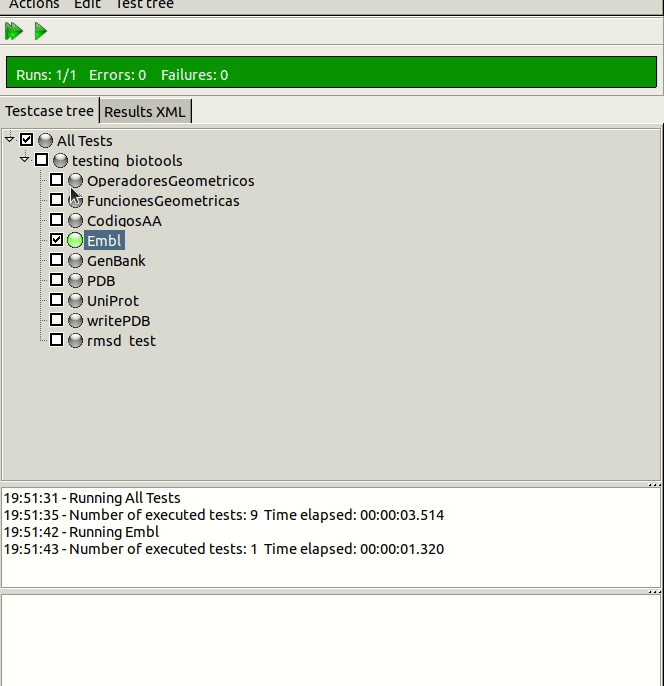

# Test Unitarios

A lo largo de esta asignatura, se han desarrollada un gran número de funciones, muchas de las cuales han sido editadas y mejoradas en varias ocasiones. Por esta razón, y en los casos que nos parecían oportunos, decidimos hacer uso de `fpcunit`, un framework de test unitarios propio del entorno Lazarus para automatizar la realización de estos. Destacar que, en varias ocasiones, hemos comenzado el desarrollo de las funciones que se nos pedía escribiendo en primer lugar.

Esta idea, empleada en metodologías de desarrollo como Test Driven Design, nos ha resultado de gran ayuda para enfrentarnos a problemas complejos. Al usarlos, hemos cambiando el flujo de trabajo al que estábamos acostumbrados, estableciendo primero las expectativas y especificaciones del código en forma de test unitario, luego escribiendo el código principal y mejorándolo hasta que superaba con éxito todos los test.

## Demostración de uso

A continuación, mostramos algunos de los procedimientos que corresponden a test unitarios así como una animación donde se muestra el funcionamiento de la interfaz gráfica del mismo.


=== "Codigos AA"

	```pascal linenums="1"
	procedure testing_biotools.CodigosAA;

	begin
	  IF AA3TO1('ALA') <> 'A' THEN
	     Fail('Fail AA3To1');
	  IF AA1TO3('R') <> 'ARG' THEN
	     Fail(AA1TO3('R'));
	  IF AA1TO3('A') <> 'ALA' THEN
	     Fail(AA1TO3('A'));

	end;

	```
=== "Funciones Geometricas"

	```pascal linenums="1"
	procedure testing_biotools.FuncionesGeometricas;
	var
	  V1, V2, V3, V4: TPunto;
	begin
	  V1.X:= 0;V1.Y:= 0;V1.Z:= 1;
	  V2.X:= 2;V2.Y:= -3;V2.Z:= 1;
	  V3.X:= -3;V3.Y:= 1;V3.Z:= 2;
	  V4.X:= -7;V4.Y:= -7;V4.Z:= -7;
	  IF modulo(V1) <> 1 THEN
	     Fail('Fail modulo()');
	  IF distancia3D(V1, V1) <> 0 THEN
	     Fail('Fail distancia3d()');
	  //IF angulo(V1, V3)*180/pi <> 180 THEN
	  //   Fail('Fail angulo()');
	    IF prodVectorial(V2, V3) <> V4 THEN
	     Fail('Fail prodVectorial()');
	end;
	```

||
|:-----------------------------------------------------------------------------:|
| Figura 1. Animación del programa `testing` mostrando su uso.|
