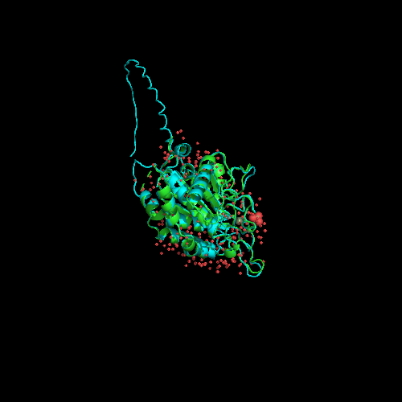

# Visualización de las estructuras

Este apartado se complementa con las imágenes y animaciones realizadas para ilustrar la revisión bibliográfica y el resto de actividades, cuando corresponde. En esas imágenes se buscaba utilizar las herramientas de un programa específico para visualizar la estructura de una proteína de forma general y en detalle (para visualizar el sitio activo, por ejemplo).

En este apartado se realizan una serie de animaciones donde se busca comparar la estructura elegida, 2AFM, con una segunda estructura. Destacar que el archivo 2AFM.pdb utilizado es un archivo que ha sido "limpiado" manualmente para tener una única copia de la proteína. Los archivos de estructura *raw* y procesados se pueden encontrar en en el directorio [visualización/data](https://github.com/currocam/biotools_hQC/tree/master/visualizacion/data). Además, se muestran, a modo de ejemplo, algunos de los scripts utilizados, pero para asegurar la reproducibilidad el resto de scripts forma parte del código del repositorio y pueden encontrarse en el [directorio 'visualización'](https://github.com/currocam/biotools_hQC/tree/master/visualizacion).  Este apartado se corresponde a la 4ª actividad de la relación de ejercicios.

## Obtención 2ª estructura

Además de la estructura 2AFM se ha elegido una segunda estructura con el objetivo de poder compararlas en el software de visualización elegido. Esa segunda estructura corresponde a la estructura predicha por AlphaFold de Q16769, la cual corresponde a QPCT, es decir, a la isoforma secretora de hQC. Se ha escogido por dos razones, en primer lugar para comparar la estructura elegida, isoforma retenida, con la secretora y, en segunda lugar, para comparar una estructura cuyo origen es experimental con una obtenida mediante el uso de IA.

### AlphaFill

Los modelos estructurales de la base de datos AlphaFold no tienen en cuenta  entidades químicas distintas de los residuos de aminoácidos naturales y no poseen, por tanto, cofactores. Esto supone un inconveniente en nuestro caso porque, como vimos en el apartado de revisión bibliográfica, la proteína hQC posee un cofactor de $\text{Zn}^{2+}$ que es imprescindible para que tenga lugar la catálisis y es, por tanto, de gran interés. Esta limitación sucede debido a que estos algoritmos de predicción (RoseTTAFold o AlphaFold, por ejemplo) no son capaces de resolver el problema del plegamiento de las proteínas mediante la  comprensión de los principios físicos subyacentes, sino que han descubierto intrincados patrones en base a las estructuras tridimensionales determinadas estructuralmente.

Este inconveniente podemos intentar resolverlo haciendo uso del algoritmo AlphaFill, el cual ha sido recientemente publicado en forma de preprint. Este algoritmo enriquece los modelos de la base de datos AlphaFold "transplantando" moléculas pequeñas e iones comunes que se hayan observado en complejos con proteínas homólogas muy similares en modelos determinados experimentalmente del banco de datos PDB-REDO7 (Hekkelman et al., 2021) [^1]. El funcionamiento del algoritmo es, a grandes rasgos, como se muestra a continuación:

1. BLAST con la secuencia de AlphaFold con las secuencias alojadas en LAHMA webserver.
2. Selección homólogos muy cercanos.
3. Alineamiento de los esqueletos peptídicos.
4. Integración de los compuestos en los modelos de AlphaFold si no estaban previamente.
5. Generación nuevo modelo.

## Comparación de 2AFM con Q16769 de AlphaFold

A continuación, se muestra una animación en la que se pueden observar las estructuras 2AFM y Q16769 de AlphaFold tras ser alineadas. Se puede observar que, exceptuando la  secuencia N-terminal responsable de su anclaje en el aparato de Golgi (diferencia biológica, puesto que son isoformas diferentes) y la ausencia de cofactores (limitación causada por el mecanismo de obtención de la estructura), ambas son extremadamente similares.  

||
|:--:|
|Figura 1. Animación de las estructuras 2AFM y Q16769. Elaboración propia usando PyMol.|

Para realizar esta animación se ha hecho uso de un pequeño script que combina comandos en PyMol con Python.

```python
set ray_opaque_background, off
load data/processed/2AFM.pdb
load data/raw/AF-Q16769-F1-model_v1.pdb
alignto 2AFM,

python

import imageio

step = 1

images = []

for a in range(0,180,step):
  cmd.rotate("y", float(step))
  cmd.ray(500, 500)
  filename = "file"+str(a)+".png"
  cmd.png(filename)
  images.append(imageio.imread(filename))

imageio.mimsave('movie1.gif', images)

python end
```

## Comparación de 2AFM con Q16769 de AlphaFill

A continuación, se muestra la estructura experimental y la obtenida de AlphaFill alineadas. Se ha coloreado las sustancias inorgánicas de la estructura experimental en marrón y las de la estructura predicha en morado. Se puede observar que, para esta estructura, el algoritmo AlphaFill no funciona adecuadamente. En primer lugar porque, en el sitio catalítico (no se puede apreciar porque están superpuestos) aunque es capaz de determinar que es necesario algún tipo de molécula cargada, se equivoca colocando un ion $\text{Fe} ^{2+}$ y no un ion $\text{Zn}^{2+}$. En segundo lugar, porque no es capaz de predecir la presencia de un grupo sulfato y, en tercer lugar, porque predice la presencia de multitud de iones $\text{Zn}^{2+}$ fuera del sitio catalítico.
El código que se ha utilizado para conseguir dicha animación es el siguiente:

```python
set ray_opaque_background, off
load data/processed/2AFM.pdb
load data/raw/Q16769_AlphaFill.cif
alignto 2AFM,
remove solvent
color brown, inorganic AND 2AFM
color purple, inorganic AND Q16769_AlphaFill
select cofactors, byres inorganic  expand 5
remove (not cofactors)
hide cartoon,
show sticks,
center cofactors
zoom

python

import imageio

step = 1
images = []

for a in range(0,180,step):
  cmd.rotate("y", float(step)) # Rotate around Y-axis
  cmd.ray(500, 500)
  filename = "file"+str(a)+".png"
  cmd.png(filename)
  images.append(imageio.imread(filename))
  cmd.ray(500, 500)
  filename = "file"+str(a)+".png"
  cmd.png(filename)
  images.append(imageio.imread(filename))

imageio.mimsave('animation.gif', images)

python end
```


||
|:--:|
|Figura 2. Animación de las estructuras 2AFM y Q16769 mostrando cofactores y residuos colindantes. Elaboración propia.|

## Conclusión

Por un lado, hemos podido observar cómo la principal diferencia entre ambas isoformas es la secuencia N-terminal responsable de su anclaje en el aparato de Golgi (Figura 1) y  como la isoforma gQC, a la que corresponde la estructura Q16769, está ligeramente más abierta en su sitio activo (Figura 2). Ambas ideas corroboran lo expuesto en el apartado de revisión bibliográfica.

Por otro lado, hemos podido comprobar que AlphaFold2 es capaz de predecir estructuras de una altísima calidad y que se superponen a la perfección con estructuras experimentales. Así mismo, hemos podido observar una de las limitaciones de este algoritmo, ausencia de otras entidades químicas, y uno de los primeros intentos para superarla, AlphaFill. En este algoritmo, aunque no funciona de forma precisa, podemos ver la potencialidad de la premisa en que, aunque se equivoca en algunos aspectos, es capaz de acertar parcialmente en otros.

## Referencias
[^1]: Hekkelman, Maarten L., Ida de Vries, Robbie P. Joosten, y Anastassis Perrakis. «AlphaFill: Enriching the AlphaFold Models with Ligands and Co-Factors». Preprint. Bioinformatics, 27 de noviembre de 2021. https://doi.org/10.1101/2021.11.26.470110.
