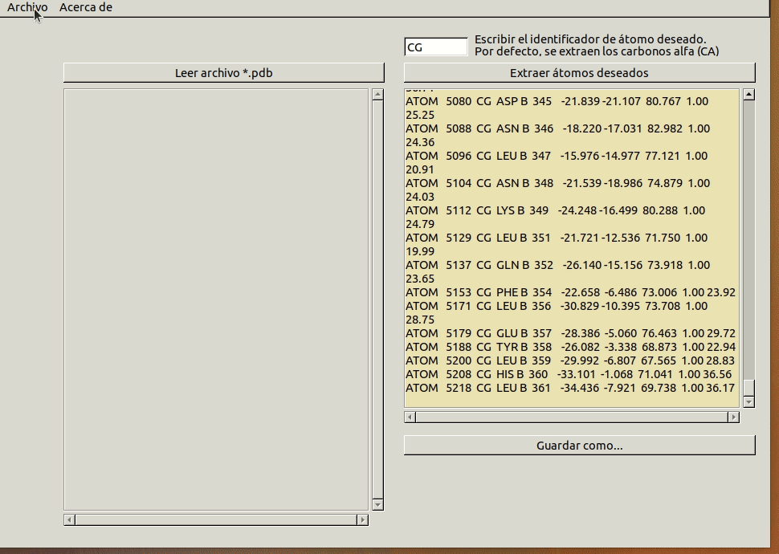

# WritePDB: Extraer átomos Carbono alfa

En la realización de este cuaderno de actividades se pide el desarrollo de una función que permite escribir la información relativa a un átomo de un archivo PDB albergada en una estructura matricial en un fichero siguiendo el formato PDB de nuevo. El objetivo es emplear dicha función para extraer los carbonos alfa de un fichero PDB, escribirlos en un archivo pseudo-pdb y estudiar el desorden de la proteína en base a su factor $\text{B}$. El factor $\text{B}$ representa el desplazamiento de los átomos de su posición media en la estructura cristalina y se observa como una disminución en la intensidad de la difracción. Puede tener dos causas: ser el resultado de vibraciones atómicas dependientes de la temperatura o del desorden estático en la estructura cristalina. Podemos utilizarlo, por tanto, como indicador de los residuos más desordenados de la proteína (Trueblood et al., 1996) [^1].

 El código correspondiente a esta funcionalidad se puede encontrar en la librería [biotools/src_biotools](https://github.com/currocam/biotools_hQC/blob/master/biotools/src_biotools.pas) y la implementación en un programa con interfaz gráfica en el repositorio bajo el nombre de [write_PDB](https://github.com/currocam/biotools_hQC/tree/master/write_PDB). Este apartado se corresponde a la 5ª actividad de la relación de ejercicios.

## WriteAtomPDB

En primer lugar, se desarrolló una función que escribiera el contenido de un `record` tipo `TAtomPDB` en una línea tipo `AnsiString` correctamente formateada. Para hacerlo, se consultó la bibliografía proporcionada para familiarizarnos con el formato PDB. Para su desarrollo se definieron también una serie de test unitarios para asegurar la función se comportaba de acuerdo a lo deseado.

A continuación, se muestra la función `WriteAtomPDB`. Para escribirla se utilizó la función `formatfloat` para convertir los valores numéricos en cadenas de texto con los números decimales adecuados y la función `format` para alinear dentro del número de espacios que ocupa cada tipo de variable en los archivos PDB a la izquierda o a la derecha, según fuera necesario. Para ello se utiliza la sintaxis `'%d'` y es, en realidad, el aspecto de mayor dificultad de esta función. Usando esta función, que acepta como argumento instancias de clase `AnsiString`, evitamos tener que definir nosotros una función que permita alinear los valores. Añadir que, puesto que no se consideraba el factor ocupancia en la estructura matricial `TAtomPDB`, no se ha incluido tampoco en este función (por lo que todos los átomos del pseudo-pdb tendrán una ocupancia idéntica e igual a 1.00).  

??? example "Función WriteAtomPDB"
	```pascal linenums="1"
	function WriteAtomPDB(atom: TAtomPDB): AnsiString;
	var
	  numatm, numres, X, Y, Z, R: AnsiString;
	  linea: AnsiString;
	begin
	    // Obtenemos la información del objeto atom en el formato numérico que nos interesa
	    numatm:= inttostr(atom.NumAtom);
	    numres := inttostr(atom.NumRes);
	    X  := formatfloat('0.000', atom.coor.X);
	    Y  := formatfloat('0.000', atom.coor.Y);
	    Z  := formatfloat('0.000', atom.coor.Z);
	    R  := formatfloat('0.00', atom.R);
	    linea:= Concat('ATOM  ' , // 6 char justificado a la izquierda
            format('%5s', [numatm]) ,  // 5 char justificado a la derecha
            '  ' , //separador de espacios
            format('%-3s', [atom.ID]) ,
            ' ' + //No incluimos altLoc
            atom.residuo,
            ' ',
            atom.subunidad,
            '  ',
            format('%-4s', [numres]), //4 char justificado a la derecha
            '  ', //No incluimos iCode
            ' ',
            format('%7s', [X]),
            ' ',
            format('%7s', [Y]),
            ' ',
            format('%7s', [Z]),
            '  ',
            format('%-5s', ['1.00']), //No incluimosla ocupancia
            format('%-6s', [R]));
            // No incluimos el resto de parámetros

	result:= linea;
	end;          
	```

### TTestCase

A continuación, se muestra a modo de ejemplo uno de los test unitarios que se escribió para comprobar el buen funcionamiento de la función `writeAtomPDB()`.

??? example "testing_biotools.writePDB"
	```pascal linenums="1"
	procedure testing_biotools.writePDB;
	// 'ATOM      1  N   ALA A  33      -6.424 -34.116  36.857  1.00 43.50')
	var
	atm: TAtomPDB;
	str1, str2: AnsiSTring;
	begin
	  atm.NumAtom := 141;
	  atm.ID := 'CA';
	  atm.residuo:= 'SER';
	  atm.subunidad := 'A';
	  atm.NumRes:= 50;
	  atm.coor.X := -24.739;
	  atm.coor.Y := -24.229;
	  atm.coor.Z := 0.489;
	  atm.R:= 22.73 ;
	  str1 :=  WriteAtomPDB(atm);
	  str2 := 'ATOM    141  CA  SER A  50     -24.739 -24.229   0.489  1.00 22.73';
	  IF NOT SameText(trim(str1),str2) THEN
	     begin
	       Fail('El formato no es el adecuado. ');
	     end;
	end;        
	```
## Demostración de uso

A continuación, se muestra una pequeña animación donde se muestra la implementación en una interfaz gráfica del código anterior. Destacar que, aunque el ejercicio pedía, en un principio, un programa capaz de extraer los carbonos $\alpha$ de un archivo PDB, nos pareció más adecuado generalizarlo a un programa capaz de extraer cualquier tipo de átomo dado por el usuario.

||
|:--:|
|Figura 1. Animación con ejemplo de uso de la aplicación writePDB para extraer átomos de cierto ID. Aplicación con interfaz gráfica realizada con Lazarus.|

## Extracción carbonos alfa y visualización en PyMol según el factor B

Por último, se realizó la tarea propuesta en el ejercicio. Se obtuvo un [pseudo archivo PDB](https://github.com/currocam/biotools_hQC/tree/master/write_PDB/data) con los átomos correspondientes a los carbonos $\alpha$ de la proteína 2AFM y, usando el programa PyMol, se obtuvo una animación de la proteína en modo spacefill y coloreada según el factor B. En pos de la reproducibilidad, se muestra a continuación tanto la animación como el script utilizado para obtenerla. No se entrará en detalles al respecto de la obtención de la animación puesto que se ha seguido usando las mismas herramientas empleadas en el apartado de Visualización de este cuaderno de actividades.

??? example "Visualización carbonos alfa 2AFM"
	```python linenums="1"
	set ray_opaque_background, off
	load write_PDB/data/2AFM_CA_pseudo.pdb
	spectrum b, blue_white_red, minimum=10, maximum=50
	as surface,
	label b >60, "(%s, %s)" % (resn, resi)
	python

	import imageio
	step = 1
	images = []
	for a in range(0,180,step):
	  cmd.rotate("y", float(step))
	  cmd.ray(500, 500)
	  filename = "file"+str(a)+".png"
	  cmd.png(filename)
	  images.append(imageio.imread(filename))
	imageio.mimsave('pseudoPDB_b_factor.gif', images)
	python end
	```

||
|:--:|
|Figura 2. Animación de los carbonos $\alpha$ de la proteína 2AFM en modo spacefill y coloreados según el factor B. Además, se han anotado los residuos que tuvieran un valor de B superior a 60|

## Interpretación de los resultados

En la animación anterior podemos observar dos cadenas, A y B, que son distintas estructuralmente. Esto, aunque podría ser poco intuitivo puesto que la proteína que estamos estudiando, 2AFM, es un monómero, sucede porque lo que contiene el PDB en realidad es la unidad asimétrica del cristal. Se puede observar cómo una de las subunidades tiene mayor factor B que la otra. Es por ello que nos inclinamos a pensar que la "versión más desordenada" debe de ser fruto de errores experimentales (y que ha sido incluido en el PDB para mayor rigurosidad).

Si nos fijamos en la estructura más ordenada, nos llama la atención cómo existen una serie de regiones en la superficie (coloreadas en rojo) de mayor Factor $\text{B}$. Interpretamos estas zonas, algunas de ellas lazos, como regiones más flexibles de la proteína y que no poseen una estructura rígida. Esta idea es compatible con el hecho de que se encuentran situadas en la superficie de la proteína y podríamos hipotetizar que serían regiones de interacción.

Destacamos, por último, que los residuos de la subunidad "ordenada" del archivo PDB que se sabía por bibliografía que eran importantes para la función catalítica de la enzima (y que se podría esperar, por ejemplo, una mayor flexibilidad) muestran valores de factor $\text{B}$ bajos, indicando así que forman parte de zonas rígidas de la estructura.

## Conclusión

En conclusión, el programa WritePDB es capaz de escribir pseudo archivos PDB con los que estudiar el desorden (fruto de errores experimentales pero también reflejo de la flexibilidad de la estructura) de una proteína. Esta información es de gran utilidad para valorar tanto las implicaciones biológicas que pueden tener regiones más rígidas o flexibles como evaluar la calidad de la estructura con que se está trabajando.


## Referencias
[^1]: Trueblood, K. N., H. B. Bürgi, H. Burzlaff, J. D. Dunitz, C. M. Gramaccioli, H. H. Schulz, U. Shmueli, y S. C. Abrahams. «Atomic Dispacement Parameter Nomenclature. Report of a Subcommittee on Atomic Displacement Parameter Nomenclature». Acta Crystallographica Section A Foundations of Crystallography 52, n.º 5 (1 de septiembre de 1996): 770-81. https://doi.org/10.1107/S0108767396005697.
